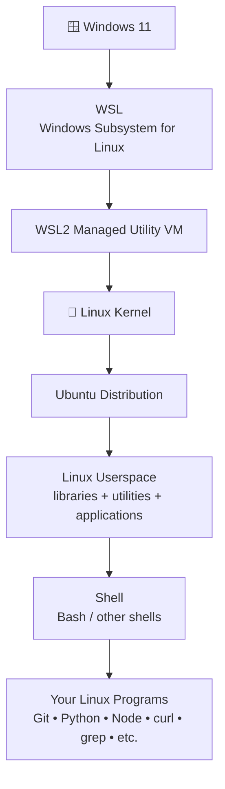
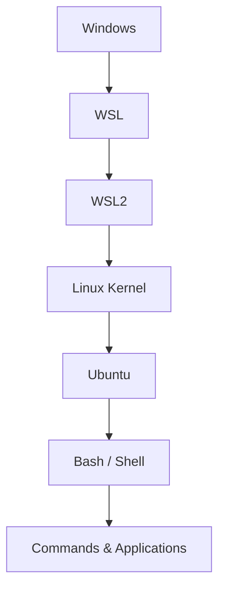
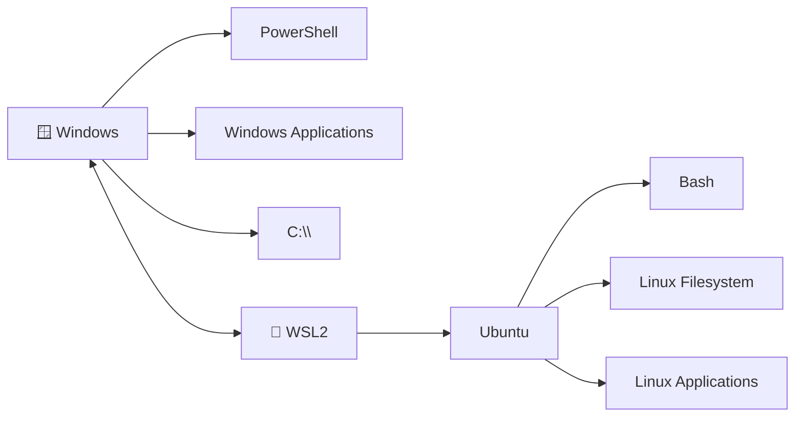
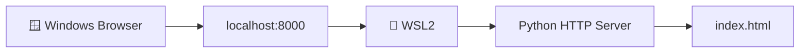
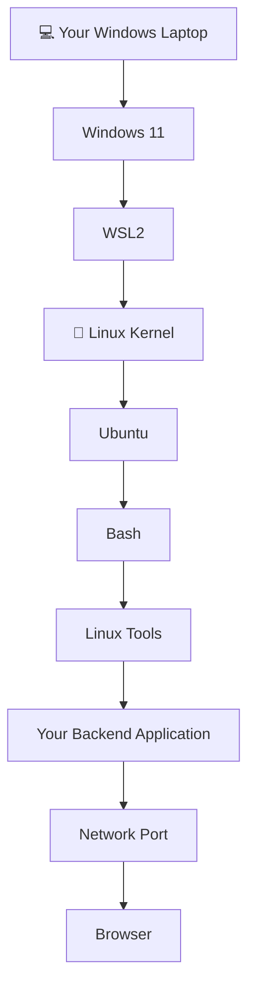

# 00 · Setting Up WSL2 and Ubuntu

> **From Windows to Linux: build the environment you'll use for the rest of the roadmap.**

---

## 🧭 Module Overview

Before learning Linux commands, we need a Linux environment.

If you're using Windows, **WSL2 + Ubuntu** gives you a Linux development environment directly on your machine without requiring dual boot.

But this module is not just:

```bash
wsl --install
```

and "congratulations, you're done."

You should understand **what you installed, why it exists, where your files live, how Windows and Linux interact, and how to verify that everything is actually working.**

That mental model will save you from a lot of confusion later when we reach:

* processes
* permissions
* networking
* SSH
* systemd
* Docker
* Kubernetes
* cloud servers

---

# 🎯 Learning Objectives

By the end of this module, you should be able to:

* Explain what Linux is
* Explain what Ubuntu is
* Explain what WSL is
* Explain the difference between WSL1 and WSL2
* Explain why WSL2 uses a Linux kernel
* Understand the relationship between Windows, WSL2, Ubuntu, and the Linux shell
* Install WSL2 and Ubuntu
* Create your first Linux user
* Verify your WSL installation
* Understand the difference between Windows commands and Linux commands
* Understand Windows ↔ Linux filesystem integration
* Know where Linux projects should normally live
* Run a Linux web server from WSL
* Access that server from Windows
* Start, stop, update, and inspect WSL
* Diagnose common installation problems
* Understand what WSL is **not**
* Confirm that your environment is ready for the rest of the Linux track

---

# 🧠 1. Why Are We Learning Linux?

Imagine you build a backend application.

Locally, it might look like this:

```text
Your Laptop
│
├── Node.js
├── PostgreSQL
├── Redis
└── Your Backend
```

Then you deploy it.

Suddenly the environment looks more like:

```text
Cloud Server
│
├── Linux
├── systemd
├── Nginx
├── Docker
├── PostgreSQL
├── Redis
├── Firewall
├── SSH
├── Logs
└── Your Backend
```

The code may be yours.

The operating environment is often Linux.

That's why Linux isn't just another tool in backend development.

It is part of the **ground beneath the tools**.

You don't need to become a Linux kernel developer.

You do need to be comfortable enough that when a production server says:

```text
Permission denied
```

you don't stare at the screen like it just insulted your ancestors.

---

# 🕰️ 2. A Very Short History

Understanding the history helps explain why WSL exists.

## 2.1 The traditional approach

For a long time, Windows developers who wanted Linux had a few major choices.

### Dual boot

Install both Windows and Linux.

```text
┌──────────────────────────────┐
│            PC                │
│                              │
│   ┌────────┐   ┌─────────┐  │
│   │Windows │   │  Linux  │  │
│   └────────┘   └─────────┘  │
│                              │
│       Choose at boot         │
└──────────────────────────────┘
```

Great isolation.

Not great when you just want to test a shell command and don't want to reboot your computer.

---

## 2.2 Virtual machines

Another option was running Linux inside a virtual machine.

```text
┌─────────────────────────────────┐
│             Windows             │
│                                 │
│  ┌───────────────────────────┐  │
│  │       Virtual Machine     │  │
│  │                           │  │
│  │          Ubuntu           │  │
│  │          Linux            │  │
│  └───────────────────────────┘  │
│                                 │
└─────────────────────────────────┘
```

This is still a perfectly valid approach.

But traditional VMs usually require more explicit management of:

* VM memory
* CPU
* virtual disks
* networking
* startup/shutdown
* virtualization software

---

# 3. Enter WSL

Microsoft introduced:

> **Windows Subsystem for Linux**

or simply:

> **WSL**

The goal was straightforward:

> Allow developers to use a Linux environment directly alongside Windows.

Microsoft describes WSL as a way to run a GNU/Linux environment, including common command-line tools and applications, directly on Windows.

---

# 4. WSL1 vs WSL2

This distinction is worth understanding.

## WSL1

WSL1 did not use a real Linux kernel.

Conceptually:

```text
Linux application
       │
       ▼
Linux system calls
       │
       ▼
Compatibility / translation layer
       │
       ▼
Windows kernel
```

It was clever technology.

But Linux and Windows do not behave identically.

Some Linux behavior is difficult to reproduce perfectly on top of another operating system.

---

## WSL2

WSL2 changed the architecture.

It uses:

* a real Linux kernel
* virtualization
* a lightweight managed virtual machine
* Linux userspace/distributions running within that environment

Conceptually:

```text
Linux application
       │
       ▼
Linux userspace
       │
       ▼
Linux kernel
       │
       ▼
WSL2 managed VM
       │
       ▼
Windows
```

This gives WSL2 much stronger Linux compatibility.

Microsoft's current documentation identifies the use of an actual Linux kernel inside a managed VM and full system-call compatibility as major differences between WSL1 and WSL2.

---

# 🏗️ 5. WSL2 Architecture

This is the diagram you should remember.



You don't need to memorize every implementation detail.

Remember this:

```text
Windows
   ↓
WSL
   ↓
WSL2
   ↓
Linux kernel
   ↓
Ubuntu
   ↓
Shell
   ↓
Your commands
```

---

# 🧩 6. WSL2 Is Not Ubuntu

This is one of the most common beginner misunderstandings.

These things are different:

### WSL

The Windows feature/platform for running Linux environments.

### WSL2

The modern WSL architecture that uses a Linux kernel in a managed VM.

### Linux

The operating-system kernel.

### Ubuntu

A Linux distribution.

### Bash

A shell used to interact with the Linux environment.

Think of it like layers:



This distinction becomes important later.

For example:

```text
Linux kernel problem
≠
Ubuntu package problem
≠
Bash problem
≠
WSL configuration problem
```

When you understand the layers, debugging becomes much easier.

---

# 🪟 7. Windows and Linux: Two Environments

After installing WSL2, you're working with two operating environments.



The environments are integrated, but they are not identical.

That's why this roadmap will always make the command context explicit.

---

# 🧪 8. Command Context Matters

## 🪟 PowerShell

```powershell
wsl --list --verbose
```

This is a Windows-side command.

---

## 🐧 Ubuntu

```bash
pwd
```

This is a Linux command.

---

### Why does this matter?

Because later you'll encounter commands such as:

```bash
systemctl
journalctl
chmod
chown
grep
awk
sed
ss
ip
```

These are Linux commands.

While:

```powershell
wsl --shutdown
wsl --update
wsl --list --verbose
```

are WSL commands normally executed from Windows.

---

# 💻 9. Prerequisites

You should have:

* Windows 11, or another supported Windows version
* Hardware virtualization support
* Internet access
* Administrator access for installation/configuration
* Enough disk space for your Linux environment

If virtualization is disabled in UEFI/BIOS, WSL2 may fail to start.

---

# 🔍 10. Check Your Existing Environment First

Never blindly install software before checking whether it already exists.

Open:

**PowerShell as Administrator**

Run:

```powershell
wsl --status
```

Then:

```powershell
wsl --list --verbose
```

You may see:

```text
  NAME      STATE           VERSION
* Ubuntu    Stopped         2
```

If you already have Ubuntu running under WSL2, congratulations.

You probably don't need to reinstall anything.

---

# 🚀 11. Install WSL

For a new installation, Microsoft's recommended path is:

```powershell
wsl --install
```

This can enable the required Windows components, install WSL, configure WSL2, and install Ubuntu.

You may be asked to restart Windows.

If Windows asks for a restart:

**Restart.**

---

## Installing Ubuntu explicitly

You can also specify Ubuntu:

```powershell
wsl --install -d Ubuntu
```

To see available distributions:

```powershell
wsl --list --online
```

Example:

```text
NAME
Ubuntu
Debian
...
```

For this roadmap, use **Ubuntu** unless you have a specific reason to use another distribution.

---

# ⚠️ 12. Important Installation Detail

If you run:

```powershell
wsl --install
```

and instead of installing anything you get the WSL help screen, WSL may already be installed.

In that situation:

```powershell
wsl --list --online
```

Then:

```powershell
wsl --install -d Ubuntu
```

If installation hangs at `0.0%`, Microsoft also provides:

```powershell
wsl --install --web-download -d Ubuntu
```

Don't randomly run ten commands from Stack Overflow.

First identify **which part of the installation actually failed**.

---

# 👤 13. First Ubuntu Launch

After installation, launch Ubuntu.

You can use the Start menu.

Or from PowerShell:

```powershell
wsl
```

Or explicitly:

```powershell
wsl -d Ubuntu
```

On first launch, Ubuntu will initialize its filesystem.

Then you'll be asked to create a Linux user.

For example:

```text
Enter new UNIX username:
```

Choose a username.

Example:

```text
developer
```

Then create a password.

---

# 🔐 14. Why Doesn't My Password Appear?

When you type a password in a Linux terminal, you may see:

```text
Password:
```

Then you type:

```text
mypassword
```

But the screen may remain:

```text
Password:
```

No:

```text
****
```

No:

```text
••••
```

Nothing.

That is normal.

The terminal is still receiving your input.

Type the password and press Enter.

---

# 👤 15. Your Windows User and Linux User Are Different

You might have:

```text
Windows account
    ↓
Tapan
```

and:

```text
Ubuntu account
    ↓
developer
```

These are separate account systems.

Your Linux account will have its own:

* home directory
* permissions
* groups
* shell
* ownership
* Linux identity

We'll explore these properly in:

```text
03-file-permissions-ownership
04-users-and-groups
```

---

# 🧪 16. First Linux Verification

Inside Ubuntu:

```bash
whoami
```

Expected:

```text
developer
```

Now:

```bash
pwd
```

Expected:

```text
/home/developer
```

Now:

```bash
cat /etc/os-release
```

You should see information identifying Ubuntu.

You can also run:

```bash
uname -r
```

This shows information about the Linux kernel currently running.

---

# 🔎 17. Verify From Windows

Exit Ubuntu:

```bash
exit
```

You should return to PowerShell.

Now:

```powershell
wsl --list --verbose
```

You should see your Ubuntu distribution and:

```text
VERSION
2
```

This is an important verification.

You have now confirmed:

```text
Windows
   ↓
WSL
   ↓
Ubuntu
   ↓
WSL version 2
```

---

# 🔄 18. WSL Lifecycle

WSL environments have a lifecycle.

Useful commands:

### Start WSL

```powershell
wsl
```

### Start a specific distribution

```powershell
wsl -d Ubuntu
```

### List distributions

```powershell
wsl --list
```

### List distributions with details

```powershell
wsl --list --verbose
```

### List currently running distributions

```powershell
wsl --list --running
```

### Stop one distribution

```powershell
wsl --terminate Ubuntu
```

### Shut down the WSL2 environment

```powershell
wsl --shutdown
```

### Update WSL

```powershell
wsl --update
```

### Check WSL version information

```powershell
wsl --version
```

### Get help

```powershell
wsl --help
```

---

# 🧠 19. `wsl --shutdown` vs `wsl --terminate`

These are different.

## Terminate one distribution

```powershell
wsl --terminate Ubuntu
```

Think:

> "Stop Ubuntu."

---

## Shutdown WSL

```powershell
wsl --shutdown
```

Think:

> "Stop the WSL2 environment."

This distinction becomes useful when troubleshooting.

---

# 📦 20. Update Ubuntu Packages

Inside Ubuntu:

```bash
sudo apt update
```

Then:

```bash
sudo apt upgrade
```

### What is happening?

`apt update` refreshes package metadata.

It does **not** mean:

> "Update every application."

It means:

> "Check the repositories and refresh the information about available packages."

Then:

```bash
sudo apt upgrade
```

actually upgrades installed packages where applicable.

---

# 🧠 21. `apt update` vs `apt upgrade`

Think of it like a store.

```text
apt update
    ↓
Refresh catalogue

apt upgrade
    ↓
Actually install available upgrades
```

So:

```bash
sudo apt update
```

and:

```bash
sudo apt upgrade
```

perform different jobs.

---

# 📁 22. Where Are My Linux Files?

This is extremely important for backend development.

Inside Ubuntu:

```bash
pwd
```

You may see:

```text
/home/developer
```

This is part of the Linux filesystem.

Windows has:

```text
C:\
```

Linux has:

```text
/
```

Your Linux home directory is:

```text
/home/developer
```

---

# 🔗 23. Windows Drives Inside Linux

Your Windows drives are exposed inside WSL.

For example:

```text
C:\
```

is generally accessible from:

```text
/mnt/c/
```

So:

```text
Windows

C:\Users\Tapan\Projects
```

can be accessed from Linux through a path such as:

```text
/mnt/c/Users/Tapan/Projects
```

---

# ⚠️ 24. Where Should Linux Projects Live?

This matters more than beginners usually realize.

If you're doing Linux-heavy development, prefer keeping your project inside the Linux filesystem.

For example:

```bash
mkdir -p ~/projects
cd ~/projects
```

Then:

```text
/home/developer/projects
```

rather than putting the project under:

```text
/mnt/c/Users/...
```

Why?

WSL2 generally performs best when Linux tools work with files stored in the Linux filesystem.

For example:

```text
🐧 Linux tools
      ↓
🐧 Linux filesystem
```

is generally preferable for Linux-heavy workflows.

---

# 🧭 25. Windows ↔ Linux File Access

From Ubuntu:

```bash
explorer.exe .
```

This opens the current Linux directory in Windows File Explorer.

That's one of the nicest WSL integration features.

You can also access Linux files from Windows through the WSL filesystem integration exposed by Windows.

The important rule is:

> **Don't treat ****`/mnt/c`**** and the Linux filesystem as interchangeable performance-wise.**

We'll use this knowledge later when working with:

* Git
* Node.js
* Python
* Docker
* databases
* build tools

---

# 🌐 26. Your First Backend Experiment

Now let's connect Linux to backend development.

Inside Ubuntu, create a test directory:

```bash
mkdir -p ~/projects/wsl-demo
cd ~/projects/wsl-demo
```

Create a small file:

```bash
echo "Hello from Linux" > index.html
```

Verify:

```bash
cat index.html
```

Expected:

```text
Hello from Linux
```

---

# 🚀 27. Start a Web Server

If Python 3 is available:

```bash
python3 --version
```

Then:

```bash
python3 -m http.server 8000
```

You should see something similar to:

```text
Serving HTTP on 0.0.0.0 port 8000
```

Your Linux environment is now running a web server.

---

# 🌍 28. Access Linux From Windows

Open your Windows browser.

Go to:

```text
http://localhost:8000
```

You should see your directory listing or:

```text
Hello from Linux
```

depending on how the directory is served.

This is a powerful moment.

You just did:



You have a Linux process serving HTTP traffic that Windows can access.

That is already a tiny backend environment.

---

# 🛑 29. Stop the Server

Return to the Ubuntu terminal where the server is running.

Press:

```text
Ctrl + C
```

The server stops.

This is your first introduction to an important backend concept:

> A server is simply a running process waiting for work.

We'll study processes properly later.

---

# 🧠 30. What Just Happened?

You started:

```bash
python3 -m http.server 8000
```

That created a process.

The process listened on:

```text
port 8000
```

Windows connected to:

```text
localhost:8000
```

WSL handled the integration.

The Linux application returned the response.

Conceptually:

```text
Browser
   │
   │ HTTP request
   ▼
localhost:8000
   │
   ▼
WSL networking
   │
   ▼
Python process
   │
   ▼
index.html
   │
   ▼
HTTP response
   │
   ▼
Browser
```

You just encountered:

* processes
* ports
* networking
* HTTP
* files
* Windows/Linux integration

We'll study each of those properly later.

---

# 🧪 31. Hands-On Lab 1: Prove Your Environment Works

Complete the following without looking at the solution.

## Task

From Windows PowerShell, determine:

1. Whether WSL is installed
2. Which distributions exist
3. Which WSL version Ubuntu uses
4. Whether Ubuntu is currently running

Useful commands:

```powershell
wsl --status
wsl --list --verbose
wsl --list --running
```

### Expected outcome

You should be able to explain something like:

```text
WSL is installed.

Ubuntu is installed.

Ubuntu is running under WSL2.

Ubuntu is currently stopped/running.
```

---

# 🧪 32. Hands-On Lab 2: Prove Linux Is Actually Linux

Inside Ubuntu, run:

```bash
whoami
```

```bash
pwd
```

```bash
cat /etc/os-release
```

```bash
uname -r
```

Now answer:

* What is your Linux username?
* What is your home directory?
* Which distribution are you using?
* Which kernel are you running?

Don't copy the answers from someone else.

Read your machine.

---

# 🧪 33. Hands-On Lab 3: Windows and Linux Files

Inside Ubuntu:

```bash
mkdir -p ~/projects/environment-test
cd ~/projects/environment-test
```

Create a file:

```bash
echo "Created inside Linux" > linux.txt
```

Now:

```bash
explorer.exe .
```

Find `linux.txt` using Windows Explorer.

Then return to Ubuntu:

```bash
cat linux.txt
```

You have now verified that Windows and Linux can interact with the same WSL environment.

---

# 🧪 34. Hands-On Lab 4: Windows → Linux → Windows

### Step 1

Inside Ubuntu:

```bash
cd ~/projects/environment-test
```

### Step 2

Run:

```bash
python3 -m http.server 8000
```

### Step 3

Open Windows browser:

```text
http://localhost:8000
```

### Step 4

Verify that your file appears.

### Step 5

Stop the server:

```text
Ctrl + C
```

### Success condition

You should be able to explain this entire path:

```text
Windows Browser
      ↓
localhost:8000
      ↓
WSL2
      ↓
Ubuntu
      ↓
Python process
      ↓
Linux filesystem
```

---

# 🧪 35. Hands-On Lab 5: Break Something on Purpose

Good engineers don't only learn when everything works.

Let's intentionally make a mistake.

Inside Ubuntu:

```bash
sduo apt update
```

You should get an error.

Now immediately run:

```bash
echo $?
```

You should see a non-zero exit status.

The exact value isn't the important lesson yet.

The important lesson is:

> Commands communicate whether they succeeded or failed.

We'll build heavily on exit codes in the Bash scripting module.

---

# 🔧 36. Troubleshooting

## Problem: `wsl` is not recognized

Possible causes include:

* WSL isn't installed
* Windows isn't updated enough
* PATH/environment problems

First check:

```powershell
wsl --help
```

If that fails, verify your Windows version and WSL installation.

---

## Problem: WSL installation requires a restart

Restart Windows.

Then run:

```powershell
wsl --status
```

---

## Problem: Ubuntu isn't installed

Run:

```powershell
wsl --list --online
```

Then:

```powershell
wsl --install -d Ubuntu
```

---

## Problem: Ubuntu is using WSL1

Check:

```powershell
wsl --list --verbose
```

If you see:

```text
Ubuntu    Stopped    1
```

you can convert the distribution:

```powershell
wsl --set-version Ubuntu 2
```

Then verify:

```powershell
wsl --list --verbose
```

You want:

```text
Ubuntu    Stopped    2
```

---

## Problem: Virtualization error

WSL2 requires virtualization support.

Check whether virtualization is enabled in your system's firmware/UEFI.

The exact setting name varies by manufacturer.

It may appear as something like:

```text
Intel Virtualization Technology
Intel VT-x
AMD-V
SVM Mode
Virtualization Technology
```

Do not blindly change unrelated BIOS settings.

---

## Problem: WSL behaves strangely

Try updating WSL:

```powershell
wsl --update
```

Then:

```powershell
wsl --shutdown
```

Start Ubuntu again:

```powershell
wsl -d Ubuntu
```

---

## Problem: Installation hangs

If installation appears stuck at `0.0%`, try:

```powershell
wsl --install --web-download -d Ubuntu
```

---

## Problem: `sudo apt update` fails

First inspect the actual error.

Don't immediately start changing DNS settings, deleting files, or copying random commands from the internet.

Check whether the problem is:

```text
DNS
network connectivity
repository availability
permissions
package configuration
```

We'll learn Linux networking and package management later.

---

# 🧯 37. Recovery Mindset

When something breaks, use this sequence:

```text
STOP
 ↓
READ THE ERROR
 ↓
IDENTIFY THE LAYER
 ↓
CHECK THE CURRENT STATE
 ↓
MAKE ONE CHANGE
 ↓
TEST AGAIN
```

For example:

```text
Ubuntu won't start
        ↓
Is WSL working?
        ↓
Is Ubuntu installed?
        ↓
Is Ubuntu WSL2?
        ↓
Is virtualization available?
        ↓
Is WSL updated?
```

This is much better than:

```text
Google random error
        ↓
copy command
        ↓
something else breaks
        ↓
Google second error
        ↓
existential crisis
```

---

# 🚫 38. What WSL Is NOT

WSL is an excellent development environment.

But don't confuse it with a production Linux server.

WSL has integration with Windows that a real Linux server doesn't have.

For example:

```text
WSL
├── Windows integration
├── /mnt/c
├── localhost integration
├── managed lifecycle
└── Windows-controlled environment
```

A typical Linux server looks more like:

```text
Cloud VM
├── Linux kernel
├── network interface
├── public/private IP
├── firewall
├── SSH
├── systemd
├── disks
└── applications
```

Later in this roadmap you'll learn how real Linux servers differ.

WSL is your **laboratory**, not your production server.

---

# 🧠 39. A Backend Developer's Mental Model

At this point, you should be able to visualize your development environment like this:



This is the environment we will build upon throughout the Linux track.

---

# 🎯 40. Scenario-Based Questions

Don't just memorize commands.

Think.

---

## Scenario 1

You run:

```powershell
wsl --list --verbose
```

and see:

```text
Ubuntu    Stopped    2
```

Is WSL broken?

**Answer:** No.

`Stopped` simply means the distribution isn't currently running.

Starting Ubuntu will launch it again.

---

## Scenario 2

You run:

```bash
pwd
```

and get:

```text
/home/developer
```

What does `/home/developer` represent?

**Answer:** Your Linux user's home directory.

---

## Scenario 3

You create a file at:

```text
/home/developer/test.txt
```

Can Windows access it?

**Answer:** Yes. WSL provides Windows/Linux filesystem integration.

---

## Scenario 4

Your project is located at:

```text
/mnt/c/Users/developer/project
```

but you're doing heavy Linux development.

Would you consider moving it into:

```text
/home/developer/project
```

?

**Answer:** Yes.

For Linux-heavy workflows, keeping files in the Linux filesystem generally provides better filesystem performance.

---

## Scenario 5

You run:

```powershell
wsl --shutdown
```

Does it uninstall Ubuntu?

**Answer:** No.

It shuts down the WSL2 environment.

Your distribution and files remain.

---

## Scenario 6

You run:

```bash
python3 -m http.server 8000
```

What does `8000` represent?

**Answer:** The TCP port on which the HTTP server is listening.

---

## Scenario 7

You close the Ubuntu terminal.

Does that automatically mean your entire Linux environment is permanently destroyed?

**Answer:** No.

Your distribution and files persist unless you explicitly remove/unregister the distribution.

---

# 🧠 41. Quick Knowledge Check

### Q1. What is Ubuntu?

A. A Windows feature
B. A Linux distribution
C. A shell
D. A package manager

<details>
<summary>Answer</summary>

**B. A Linux distribution**

</details>

---

### Q2. What does WSL stand for?

A. Windows System Linux
B. Windows Subsystem for Linux
C. Windows Shell Layer
D. Windows Server Linux

<details>
<summary>Answer</summary>

**B. Windows Subsystem for Linux**

</details>

---

### Q3. What is the biggest architectural difference between WSL1 and WSL2?

A. WSL2 uses a real Linux kernel
B. WSL2 doesn't support Linux
C. WSL1 uses Ubuntu
D. WSL2 removes virtualization

<details>
<summary>Answer</summary>

**A. WSL2 uses a real Linux kernel**

</details>

---

### Q4. Which command shows your installed WSL distributions and their WSL version?

A.

```powershell
wsl --status
```

B.

```powershell
wsl --list --verbose
```

C.

```powershell
wsl --shutdown
```

D.

```powershell
wsl --update
```

<details>
<summary>Answer</summary>

**B.**

</details>

---

### Q5. Where does `/mnt/c` generally point?

A. Linux root
B. Windows C: drive
C. Ubuntu installation directory
D. Kernel directory

<details>
<summary>Answer</summary>

**B. Windows C: drive**

</details>

---

### Q6. What does this command do?

```powershell
wsl --shutdown
```

<details>
<summary>Answer</summary>

It shuts down the WSL2 environment. It does not uninstall your Linux distribution.

</details>

---

### Q7. Why is this usually preferred for Linux-heavy development?

```text
/home/developer/project
```

instead of:

```text
/mnt/c/Users/developer/project
```

<details>
<summary>Answer</summary>

Linux tools generally perform better when working with files stored in the Linux filesystem rather than the mounted Windows filesystem.

</details>

---

# 🏆 42. Final Challenge

You now have enough knowledge to verify your entire environment without following a tutorial step-by-step.

## Your mission

Starting from Windows PowerShell:

### 1. Verify WSL

```powershell
wsl --status
```

### 2. Verify Ubuntu

```powershell
wsl --list --verbose
```

### 3. Enter Ubuntu

```powershell
wsl -d Ubuntu
```

### 4. Verify your Linux identity

```bash
whoami
```

### 5. Verify your Linux home

```bash
pwd
```

### 6. Verify Ubuntu

```bash
cat /etc/os-release
```

### 7. Verify the Linux kernel

```bash
uname -r
```

### 8. Create a backend workspace

```bash
mkdir -p ~/projects/wsl-capstone
cd ~/projects/wsl-capstone
```

### 9. Create a webpage

```bash
echo "Linux backend environment is working!" > index.html
```

### 10. Start a server

```bash
python3 -m http.server 8000
```

### 11. Open Windows browser

Visit:

```text
http://localhost:8000
```

### 12. Stop the server

```text
Ctrl + C
```

### 13. Return to Windows

```bash
exit
```

### 14. Verify again

```powershell
wsl --list --verbose
```

---

# 🎓 43. Graduation Checklist

You are ready for the next module when you can honestly answer yes to every item below.

> [!check]
> - I know what Linux is.
> - I know what Ubuntu is.
> - I know what WSL is.
> - I understand the difference between WSL1 and WSL2.
> - I know that WSL2 uses a Linux kernel.
> - I understand that WSL2 uses virtualization.
> - I can explain the relationship between Windows, WSL2, Ubuntu, and Bash.
> - I can open Ubuntu.
> - I can identify my Linux username.
> - I can identify my Linux home directory.
> - I can check my Ubuntu release.
> - I can check my Linux kernel.
> - I can verify that Ubuntu is running under WSL2.
> - I know the difference between `wsl --terminate` and `wsl --shutdown`.
> - I know where `/mnt/c` comes from.
> - I understand where Linux projects should normally live.
> - I can open a Linux directory using Windows Explorer.
> - I can start a Linux HTTP server.
> - I can access that server from Windows.
> - I can stop the server.
> - I can troubleshoot basic WSL installation problems.

If you can do all of that without blindly copying commands, you're ready.

---

# 🔗 44. Official References

Use primary documentation whenever possible.

* Microsoft Learn: WSL installation
* Microsoft Learn: WSL basic commands
* Microsoft Learn: WSL architecture and WSL2
* Microsoft Learn: WSL configuration
* Ubuntu documentation for WSL
* WSL GitHub repository

The official documentation should be your source of truth when commands or behavior change across Windows/WSL releases.

---

# 🚀 What's Next?

You've built the environment.

Now we're going to learn how to actually **talk to Linux**.

Next:

## [01 · Shell Basics and Unix Philosophy](../01-shell-basics-and-philosophy/README.md)

You'll learn:

```text
Terminal
   ↓
Shell
   ↓
Command
   ↓
Process
   ↓
Kernel
```

You'll learn:

* What a shell actually is
* What happens when you type a command
* How Linux commands are structured
* The Unix philosophy
* `man`
* `help`
* `--help`
* command history
* tab completion
* command discovery
* exit status

And from there, we start properly learning Linux.

---

# 🧭 Linux Track

```text
00  Setup WSL2
 ↓
01  Shell Basics
 ↓
02  Filesystem Navigation
 ↓
03  Permissions & Ownership
 ↓
04  Users & Groups
 ↓
05  Package Management
 ↓
06  Process Management
 ↓
07  I/O Redirection & Pipes
 ↓
08  Text Processing
 ↓
09  Bash Scripting
 ↓
10  Networking
 ↓
11  systemd
 ↓
12  Disk & Storage
 ↓
13  SSH
 ↓
14  Logging
 ↓
15  Security
 ↓
16  Capstone
 ↓
🐳 Docker
```

**You now have a Linux machine.**

Next, we're going to learn how to use it.
