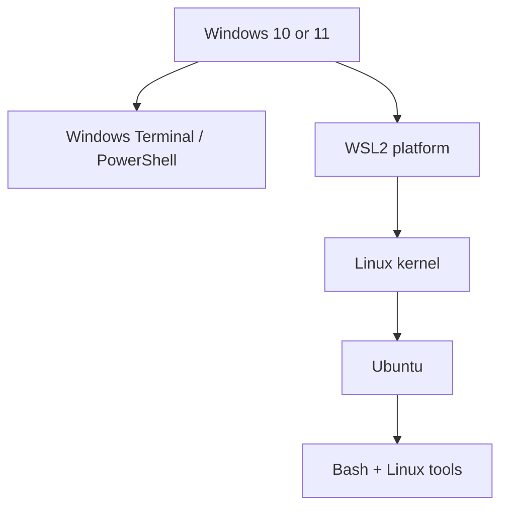
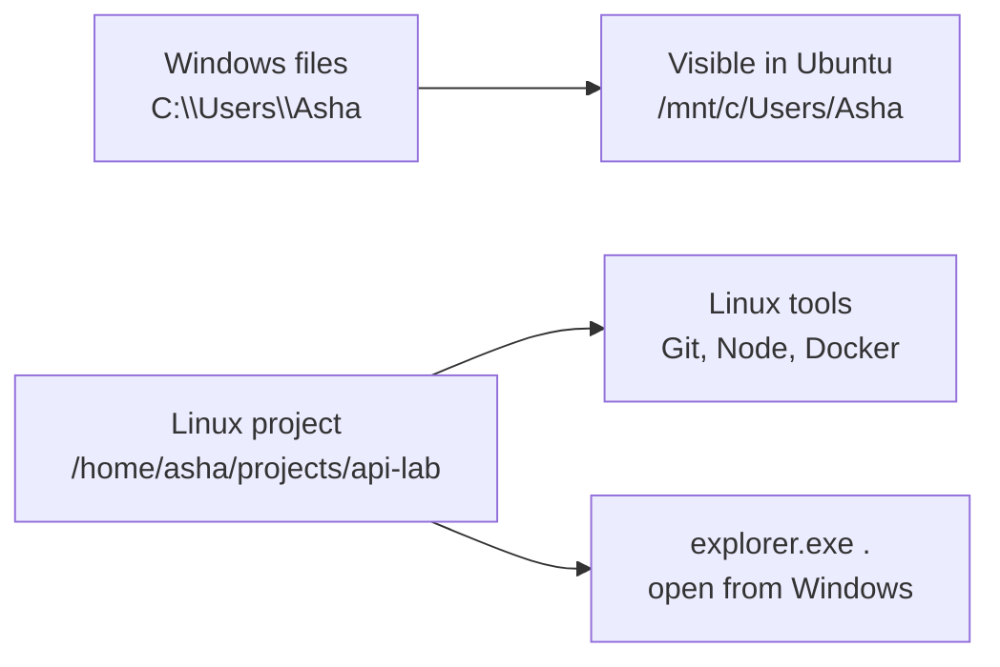

# Module 00: Set Up WSL2 and Ubuntu

> 🎯 **Goal:** Prepare a Linux environment on Windows for the backend roadmap.

By the end of this module, you should be able to install or verify Ubuntu on WSL2, distinguish Windows from Linux command contexts, keep projects in the right filesystem, and prove the environment works with a small local web server.

---

## Why this matters

Backend services, containers, CI runners, and cloud servers commonly run on Linux. WSL2 gives you a real Linux kernel and an Ubuntu environment on your Windows machine, so the tools you learn here transfer to later Docker, Kubernetes, and backend modules.

> [!key]
> Windows and Ubuntu are connected by WSL2, but they are still different environments. A command, path, user, and package manager belong to the environment in which you run them.

## 1. The pieces of your environment

| Term | Meaning |
| --- | --- |
| PowerShell / Windows Terminal | A Windows command environment |
| WSL2 | Windows technology that hosts a Linux environment |
| Linux kernel | The core OS component WSL2 runs |
| Ubuntu | The Linux distribution installed inside WSL2 |
| Bash | A common command interpreter running inside Ubuntu |

> [!model]
> Think of WSL2 as a small Linux computer hosted by Windows. Windows starts it, Ubuntu supplies the Linux tools, and Bash is how you issue Linux commands.



WSL2 is not a cloud server or a replacement for Windows. It is a local Linux development environment. You will typically use Windows for your editor and browser, and Ubuntu for Linux commands and Linux-focused development.

## 2. Check what is already installed

Open **PowerShell** or **Windows Terminal** and run:

```powershell
wsl --status
wsl --list --verbose
```

The first command shows a configuration summary. The second lists distributions and their WSL version. If Ubuntu is listed with VERSION `2`, you can move to the verification section.

> [!check]
> Before installing anything, confirm:
> - Are you in a Windows prompt (`PS C:\...>`) rather than an Ubuntu prompt?
> - Is Ubuntu already installed?
> - If it is installed, does it use version 2?

## 3. Install Ubuntu if needed

In an **Administrator PowerShell** window, run:

```powershell
wsl --install -d Ubuntu
```

Restart Windows if prompted. Launch **Ubuntu** from the Start menu. On its first launch, choose a simple Linux username and a password you can remember.

No characters appear while entering a Linux password—not even dots. That is normal.

If an existing distribution uses WSL1, convert it from Administrator PowerShell:

```powershell
wsl --set-version Ubuntu 2
```

Use the exact distribution name shown by `wsl --list --verbose` when it differs from `Ubuntu`.

> [!pitfall]
> Your Windows username and Ubuntu username are separate. Your Linux home directory is usually `/home/your-linux-name`; it is not `C:\Users\your-windows-name`.

## 4. Know which terminal owns a command

| Prompt | Environment | Examples |
| --- | --- | --- |
| `PS C:\Users\...>` | PowerShell on Windows | `wsl --status`, `wsl --shutdown` |
| `name@machine:~$` | Bash in Ubuntu | `pwd`, `sudo apt update`, `ls` |

Enter your default Ubuntu distribution from PowerShell:

```powershell
wsl
```

Return to PowerShell from Bash:

```bash
exit
```

> [!example]
> `wsl --shutdown` is a Windows-side management command. `sudo apt update` is an Ubuntu-side package command. When a command is “not found,” first check which prompt you are using.

## 5. Verify Ubuntu

In an Ubuntu terminal, run:

```bash
whoami
pwd
uname -a
cat /etc/os-release
```

You should see your Linux username, a path under `/home`, kernel information that mentions WSL or Microsoft, and Ubuntu release information.

Then refresh available package metadata and apply current updates:

```bash
sudo apt update
sudo apt upgrade
```

The APT module explains package management later. For now, read the proposed changes before confirming and do not interrupt a package operation midway.

## 6. Keep Linux projects in the Linux filesystem

Linux can access the Windows C: drive at `/mnt/c`:

```text
C:\Users\Asha\notes.txt  →  /mnt/c/Users/Asha/notes.txt
```

Windows can open the current Linux directory in Explorer from Ubuntu:

```bash
explorer.exe .
```

For the course, keep Linux-heavy projects under your Linux home directory, for example `~/projects/api-lab`. This typically gives more predictable file watching, permissions, and tooling performance than developing directly in `/mnt/c`.



> [!pitfall]
> Windows-mounted files and Linux files do not have identical permission and performance behavior. Unless a task says otherwise, create course projects under `~/projects`.

## 7. WSL lifecycle commands

Run these from **PowerShell**, not Bash.

| Command | Use it when |
| --- | --- |
| `wsl` | You want to enter the default distribution |
| `wsl -d Ubuntu` | You want to enter a named distribution |
| `wsl --list --verbose` | You need distributions and their WSL versions |
| `wsl --status` | You need a configuration summary |
| `wsl --update` | You want to update WSL itself |
| `wsl --shutdown` | You need a clean reset of all WSL distributions |

`wsl --shutdown` stops every running Linux process, so save work first.

## Guided lab: prove the setup end to end

This lab creates a disposable Linux project, starts a server inside Ubuntu, reaches it from a Windows browser, and removes it afterward.

> [!exercise]
> Run these commands in Ubuntu. Each result proves a different part of the environment is working.

### 1. Create a Linux workspace

```bash
mkdir -p ~/projects/wsl-proof
cd ~/projects/wsl-proof
pwd
```

Expected: the final path starts with `/home/`, not `/mnt/c`.

### 2. Create a page

```bash
printf '<h1>WSL is working</h1>\n' > index.html
ls -l index.html
```

Expected: `index.html` is listed and owned by your Linux account.

### 3. Start a local server

```bash
python3 -m http.server 8000
```

Expected: Python reports that it is serving HTTP on port 8000. Keep this terminal open.

### 4. Reach it from Windows

Open [http://localhost:8000](http://localhost:8000) in a Windows browser. You should see **WSL is working**.

> [!model]
> The browser runs on Windows, the Python server runs in Ubuntu, and WSL exposes the local connection through `localhost`. This is the same basic request path later used by local APIs.

### 5. Open the project in Explorer

In a second Ubuntu terminal, run:

```bash
cd ~/projects/wsl-proof
explorer.exe .
```

Expected: Windows Explorer opens the Linux project directory. This proves Windows can inspect the project without moving it into `C:\`.

### 6. Stop and clean up

Press `Ctrl+C` in the terminal running the server. Then run:

```bash
rm -r ~/projects/wsl-proof
```

Expected: `ls ~/projects/wsl-proof` reports that the directory no longer exists.

## Independent challenge

Without copying the lab commands, create `~/projects/environment-check` and a one-line `status.txt` file that contains:

- your Linux username;
- the current directory;
- the Ubuntu release name.

Then open the directory in Windows Explorer, inspect the file, and remove the directory from Ubuntu. Explain which steps happened in Linux and which used a Windows application.

> [!interview]
> A teammate stores a Docker project under `C:\Users\...` and sees slow file watching and unfamiliar permission behavior. Explain why you would recommend moving it to their Linux home directory, while still using a Windows editor or browser when useful.

## Troubleshooting

### `wsl` is not recognized

Confirm that you are in a current PowerShell window. If it is still unavailable, follow Microsoft's installation instructions below rather than downloading WSL from an untrusted source.

### Ubuntu will not start or needs a restart

Restart Windows after an installation or feature change. Then run `wsl --status` and `wsl --list --verbose` from PowerShell.

### Ubuntu is version 1

Run `wsl --set-version <distribution-name> 2` from Administrator PowerShell, using the exact name shown in the distribution list.

### `sudo` rejects the password

Use the password chosen during Ubuntu's first launch, not your Windows password. No characters appear while typing. If you genuinely forgot it, use Microsoft's WSL recovery guidance rather than guessing repeatedly.

### `python3` is missing

Run `sudo apt update`, then install it with `sudo apt install python3`.

### The browser cannot reach `localhost:8000`

Confirm the Python process is still running. From Ubuntu, test `curl http://localhost:8000`. If WSL networking appears stale, stop the server, run `wsl --shutdown` from PowerShell, then restart Ubuntu.

## Checkpoint quiz

> [!check]
> 1. What is the difference between WSL2 and Ubuntu?
> 2. Which prompt indicates PowerShell instead of Bash?
> 3. Where should a Linux-heavy course project normally live, and why?
> 4. Which Windows command lists distributions and WSL versions?
> 5. What does `wsl --shutdown` stop?
> 6. How can you open the current Linux directory in Windows Explorer?

## Further reading

- [Microsoft: Install WSL](https://learn.microsoft.com/windows/wsl/install)
- [Microsoft: Basic commands for WSL](https://learn.microsoft.com/windows/wsl/basic-commands)
- [Microsoft: Filesystem performance across OS file systems](https://learn.microsoft.com/windows/wsl/filesystems)

## Next

Continue to [01 · Shell Basics and Unix Philosophy](../01-shell-basics-and-philosophy/README.md). Your environment is ready; the next module explains how the terminal and shell interpret the commands you type.
