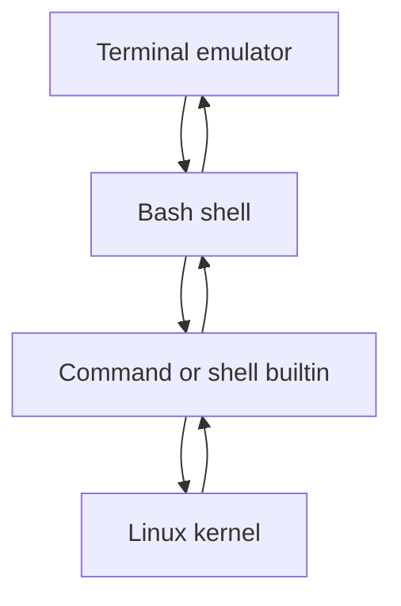
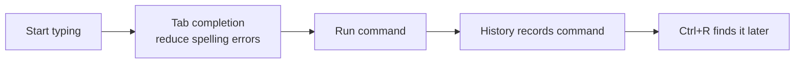
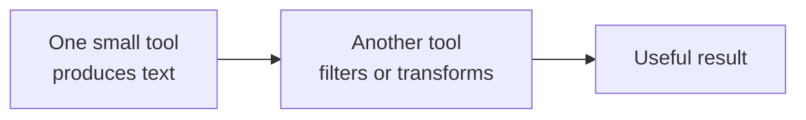

# Module 01: Shell Basics and Unix Philosophy

> 🎯 **Goal:** Use the Linux terminal as a tool you can reason about rather than a list of commands to memorize.

By the end of this module, you should be able to distinguish a terminal from a shell, read a Bash prompt, understand a command's parts, find help for unfamiliar commands, use completion and history, and explain why small Linux tools compose well.

---

## Why this matters

You will use the terminal to inspect logs, start development servers, connect to remote machines, run Git and Docker commands, and debug deployments. The syntax matters, but the more useful skill is understanding what the shell is doing with the text you type.

> [!key]
> A terminal displays text. A shell interprets commands. A command is a program or shell feature the shell runs. These are separate layers with separate failure modes.

## 1. Terminal, shell, command, and kernel

| Layer | Responsibility | Example |
| --- | --- | --- |
| Terminal emulator | Displays input and output | Windows Terminal |
| Shell | Reads and interprets a command line | Bash |
| Command | Performs a task | `pwd`, `ls`, `git` |
| Kernel | Manages processes, files, and devices | Linux kernel |



> [!example]
> If Windows Terminal will not open, that is a terminal problem. If Bash says `syntax error`, it parsed your command unsuccessfully. If `git` says it cannot find a repository, the command ran but encountered an application-level problem.

## 2. Read the prompt before acting

A typical Bash prompt looks like this:

```text
asha@laptop:~/projects$
```

| Part | Meaning |
| --- | --- |
| `asha` | Current Linux username |
| `laptop` | Hostname |
| `~/projects` | Current directory; `~` means your home directory |
| `$` | A normal user's prompt |

The root account commonly ends with `#`. Treat that as a reminder to slow down: a root command can change any part of the system.

> [!pitfall]
> Do not type the `$` or `#` prompt marker when copying a command from documentation. It is usually a visual cue, not part of the command.

## 3. Commands have a predictable shape

Most command lines follow this pattern:

```text
command   options   arguments
git       status    --short
```

- The **command** chooses a program or shell feature.
- An **option** changes behavior, often starting with `-` or `--`.
- An **argument** is the item the command acts on.

For example:

```bash
ls -la ~/projects
```

`ls` lists; `-l` asks for a detailed view; `-a` includes dotfiles; `~/projects` is the target directory.

> [!model]
> Treat a command line like a short request: choose the tool, choose how it should behave, and name the data or location it should use. When an unfamiliar command fails, identify which part you need to inspect instead of changing everything at once.

## 4. Some commands are built into Bash

Not every command is a file on disk. `cd`, `alias`, and `history` are shell builtins; they must change or inspect the current shell, so launching a separate program would not work.

Use these commands to identify what you are invoking:

```bash
type cd
type ls
command -v git
```

`type` tells you whether a name is a builtin, alias, function, or executable. `command -v` gives a concise lookup that is useful in scripts.

## 5. Documentation is part of the workflow

You should not memorize every option. Use the documentation closest to the command:

| Need | Use | Example |
| --- | --- | --- |
| A quick overview | `command --help` | `ls --help` |
| Full manual | `man command` | `man ls` |
| Help for a Bash builtin | `help builtin` | `help cd` |
| What a name refers to | `type name` | `type echo` |

Inside `man`, press `q` to quit and `/word` to search. A manual page has not frozen the terminal; it has opened a pager waiting for navigation.

> [!exercise]
> Compare `type cd`, `help cd`, `cd --help`, and `man cd`. Record which one gives useful Bash documentation and why the others differ.

## 6. Completion and history reduce mistakes

Press `Tab` to ask Bash to complete a command, path, or option. Press it twice when there is more than one possible completion.

Useful history controls:

| Action | Key or command |
| --- | --- |
| Previous command | Up arrow |
| Search backward through history | `Ctrl+R` |
| Show history | `history` |
| Re-run the previous command | `!!` |
| Clear the screen | `clear` |

`clear` changes what you see; it does not erase your command history.



> [!pitfall]
> `!!` is convenient but can be dangerous after a destructive or privileged command. Press Up to inspect and edit the command before re-running it, especially when it begins with `sudo` or `rm`.

## 7. Errors are useful evidence

Read an error literally before adding `sudo`, changing a path, or searching online.

| Error | Usually means | First check |
| --- | --- | --- |
| `command not found` | Bash cannot locate that command name | spelling, installation, `type` |
| `No such file or directory` | A path is wrong or the item is absent | `pwd`, `ls`, spelling |
| `Permission denied` | The process lacks required access | owner, mode, parent directories |
| `syntax error` | Bash could not parse the command | quotes, operators, parentheses |

> [!example]
> `cd projects` fails with “No such file or directory,” while `cd ~/projects` works. The command was valid; the first path was relative to a different current directory.

## 8. The Unix philosophy: compose focused tools

Linux tools often do one task well and pass text to another tool. You will learn pipes in module 07, but the idea matters now: a command's output can become another command's input.



This model is why commands such as `ls`, `grep`, `sort`, `curl`, and `journalctl` work well together. It is not an absolute rule—some data is binary or structured—but it is a powerful default for command-line work.

> [!interview]
> Explain the difference between a terminal and a shell. Then explain why a developer benefits from small commands that can be connected instead of one giant command that tries to do everything.

## Guided lab: become your own documentation engine

Work in your Ubuntu terminal.

### 1. Identify your environment

```bash
whoami
hostname
pwd
echo "$SHELL"
```

Expected: you can name the current user, machine, directory, and shell path.

### 2. Inspect command types

```bash
type cd
type pwd
type ls
command -v python3
```

Expected: `cd` is a Bash builtin; `ls` and `python3` are normally executable programs; `pwd` may be either a builtin or executable depending on Bash behavior.

### 3. Discover one unfamiliar option

```bash
date --help
man date
```

Use `/format` inside the manual page, then press `q`. Do not try to memorize output formats; prove that you can find them.

### 4. Use completion deliberately

Type `cd ~/pro` and press `Tab`. If there are several matches, press `Tab` again to view them. Finish the path without typing the rest manually.

### 5. Use history safely

```bash
echo "shell practice"
history | tail -n 5
```

Use Up arrow to bring back the `echo` command, change its text, and run it. Then press `Ctrl+R`, type part of `shell practice`, and locate the earlier command.

### 6. Read an error

```bash
not-a-real-command
```

Expected: `command not found`. Use `type not-a-real-command` to confirm that Bash cannot resolve the name.

## Independent challenge

You are given this request: “Find the current directory, list everything in it including hidden names, and learn how `ls` sorts its output.”

Write the commands you would use, identify which command feature solves each part, and use built-in documentation to find one sorting option you did not already know.

> [!check]
> 1. Can you explain terminal, shell, command, and kernel in one sentence each?
> 2. Can you tell whether a name is a Bash builtin or executable?
> 3. Which help system works for `cd`?
> 4. Does `clear` erase command history?
> 5. What does `Ctrl+R` do?
> 6. Why should you read an error before trying `sudo`?
> 7. What does it mean for Unix tools to compose?

## Further reading

- [GNU Bash Reference Manual](https://www.gnu.org/software/bash/manual/)
- [GNU Coreutils: Common options](https://www.gnu.org/software/coreutils/manual/)
- [`man7.org`: intro(1)](https://man7.org/linux/man-pages/man1/intro.1.html)

## Next

Continue to [02 · Filesystem Navigation](../02-filesystem-navigation/README.md). The shell needs paths and files to operate on; the next module builds that vocabulary.
