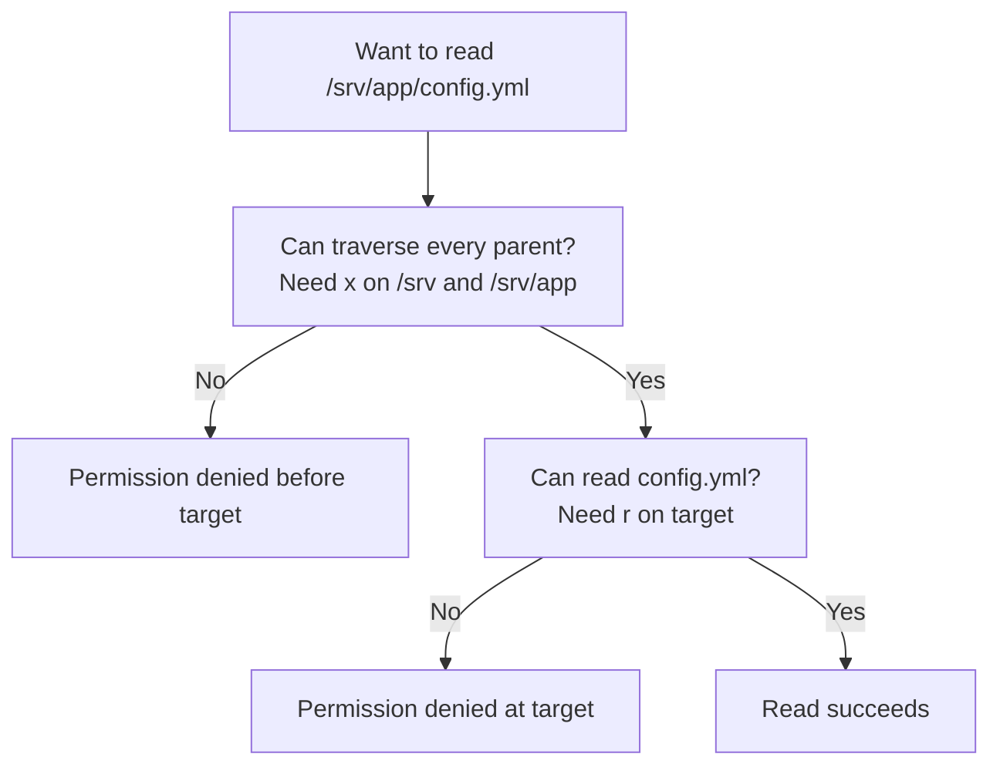
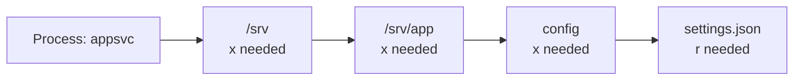
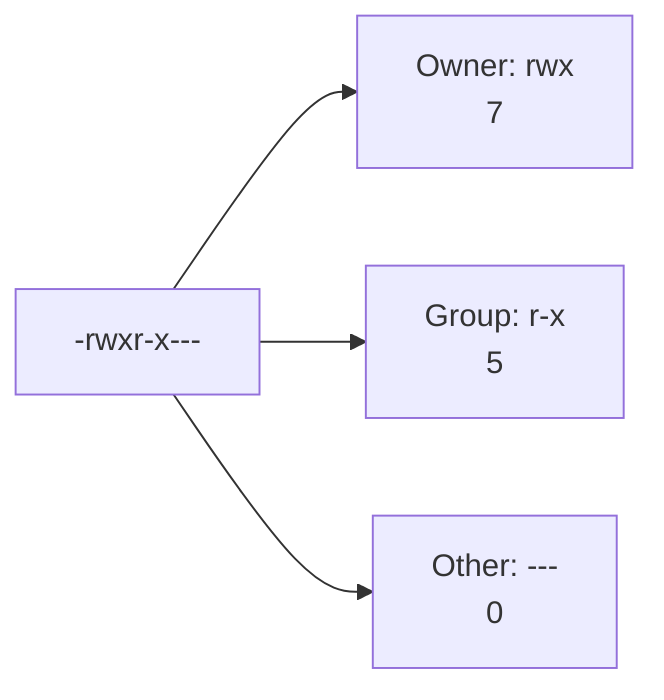

# Module 03: File Permissions and Ownership

> 🎯 **Goal:** Read Linux permissions with confidence, choose the least access a file needs, and recover safely from a permission failure.

By the end of this module, you should be able to inspect ownership, explain the meaning of each permission bit on files *and* directories, use symbolic and octal `chmod` deliberately, and recognize when `sudo` is appropriate rather than using it by reflex.

---

## Why this matters
Nearly every confusing "Permission denied" error you'll hit in Linux, Docker, or Kubernetes comes down to the concepts in this module - who owns a file and what they're allowed to do with it. Docker containers run processes as specific users with specific permissions, and getting file permissions wrong is one of the most common causes of broken deployments. Understanding this model now will save you hours of confusion later.

## Concepts

### Your operating rule: inspect before changing

Permissions are security controls, not decoration. Before changing a mode or owner, inspect the target with `ls -ld path` (a directory) or `ls -l path` (a file), state who needs access and why, then make the smallest change that solves the problem. Avoid copying commands such as `chmod -R 777` from a forum: they can make application data writable by every local process and hide the real ownership problem.

**Every file has an owner and a group.** When you create a file (with `touch`, for example), Linux automatically records two things about it: which **user** owns it, and which **group** it belongs to. Think of the owner as "the specific person responsible for this file" and the group as "a team of users who share some level of access to it." A file can only have one owner and one group at a time, but a user can belong to multiple groups.

**Three categories of "who," three kinds of access.** Linux permissions boil down to answering nine yes/no questions, organized as a 3x3 grid:

Categories of "who" can access the file:
- **owner (u)** - the single user who owns the file.
- **group (g)** - any user who is a member of the file's group.
- **other (o)** - everyone else on the system.

Kinds of access each category can have:
- **read (r)** - view the file's contents (or, for a directory, list what's inside it).
- **write (w)** - modify the file's contents (or, for a directory, add/remove/rename files inside it).
- **execute (x)** - run the file as a program/script (or, for a directory, "enter" it - i.e. `cd` into it or access files inside by full path).

So permissions are really: what can the owner do, what can the group do, what can everyone else do - each answered with some combination of read/write/execute.

**Reading `ls -l` output.** Recall from module 02 that `ls -l` shows a detailed listing. The very first column is a 10-character permissions string, like this:
```
-rwxr-xr--
```
Broken down:
- The first character is the file **type**: `-` means a regular file, `d` means a directory (there are other rarer types too, but these two cover almost everything you'll see as a beginner).
- The next 9 characters are three groups of three: owner (`rwx`), group (`r-x`), and other (`r--`). In each group, the letters appear in a fixed order - `r`, then `w`, then `x` - and a `-` means that particular permission is absent.

So `-rwxr-xr--` means: it's a regular file; the owner can read, write, and execute it; the group can read and execute it (but not write); and everyone else can only read it.

```
  -    rwx    r-x    r--
  │     │      │      │
  │     │      │      └── other: read only
  │     │      └── group: read + execute
  │     └── owner: read + write + execute
  └── type: '-' regular file ('d' would mean directory)
```

Further along an `ls -l` line, you'll also see the owner's username and the group name printed as separate columns, e.g.:
```
-rwxr-xr-- 1 alice developers 220 Jul 24 10:03 deploy.sh
```
Here `alice` is the owner and `developers` is the group.

**Symbolic vs. octal notation for `chmod`.** `chmod` ("change mode") is the command used to change a file's permissions. It accepts two different styles of describing the new permissions:

*Symbolic notation* directly names who and what, using letters:
- Who: `u` (owner/user), `g` (group), `o` (other), `a` (all three).
- Action: `+` (add a permission), `-` (remove a permission), `=` (set exactly, wiping out anything not listed).
- Permission: `r`, `w`, `x`.

So `chmod u+x script.sh` adds execute permission for the owner only, and `chmod go-w file.txt` removes write permission from group and other.

*Octal notation* represents each category's permissions as a single digit from 0-7, by adding up values: read = 4, write = 2, execute = 1. Three digits in a row represent owner, group, other respectively.
- `7` = 4+2+1 = read+write+execute (all three).
- `6` = 4+2 = read+write only.
- `5` = 4+1 = read+execute only.
- `4` = read only.
- `0` = no permissions at all.

So `chmod 750 script.sh` means: owner gets 7 (rwx), group gets 5 (r-x), other gets 0 (nothing) - which matches the `-rwxr-x---` string you'd see in `ls -l`.

```
                owner    group    other
   permission:   rwx      r-x      ---
   bit values:  4+2+1    4+0+1    0+0+0
   digit:         7        5        0     →  chmod 750
```

**Ownership: `chown` and `chgrp`.** While `chmod` changes *what* is allowed, `chown` changes *who owns* the file, and `chgrp` changes *which group* owns it. Changing ownership to another user typically requires `sudo`, since you can't just hand your files to someone else without administrator rights (and vice versa, you can't take files from other users without it either).

**Umask - a basic introduction.** When you create a new file or directory, Linux doesn't start it at "no permissions" - it starts from a default and then subtracts based on a setting called the **umask** ("user file-creation mask"). On a typical Ubuntu setup, new files are usually created as `rw-r--r--` (644) and new directories as `rwxr-xr-x` (755) by default. You don't need to configure umask yourself as a beginner - just understand that this is *why* newly created files already have some permissions set even though you never ran `chmod` on them.

### 1. Permission classes are selected, not combined

Linux does **not** add together the owner, group, and other triples for one access check.

It selects exactly one class:

1. If the process UID matches the file owner, Linux uses the **owner** triple.
2. Otherwise, if one of the process's groups matches the file group, Linux uses the **group** triple.
3. Otherwise, Linux uses the **other** triple.

This explains a surprising case. If you own a file with mode `640`, you cannot use its group's read permission to bypass the owner's missing read bit: once you match the owner, the owner triple is the one that applies.

> [!example]
> `-w-r----- alex developers config.yml` gives owner `alex` write-only access, even if Alex also belongs to `developers`. The group read bit does not supplement the owner's missing read bit. Change the owner mode deliberately instead of assuming group membership will help.

### 2. A directory is a lookup table, not a regular file

The same `r`, `w`, and `x` letters have a different practical effect on directories.

| Directory permission | What it allows | What it does **not** guarantee |
| --- | --- | --- |
| `r` | List directory entry names | Open an entry or `cd` into the directory |
| `w` | Create, delete, and rename entries | Read the contents of those files |
| `x` | Traverse the directory and access a known entry by name | List all entry names |
| `rwx` | List, traverse, and change entries | Permission to ignore the target file's mode |

The subtle consequence is that deleting `team/report.txt` depends primarily on write and execute permission on the **`team` directory**, not write permission on `report.txt`. The sticky bit, covered below, adds a safety rule for shared directories.



### 3. Executing a file is more than setting `x`

The execute bit only permits an attempt to execute. The file must still contain something Linux can run:

- a native executable format, or
- a script with a valid interpreter line, such as `#!/usr/bin/env bash`.

For a shell script, `chmod u+x deploy.sh` and `./deploy.sh` use the interpreter declared in its shebang. `bash deploy.sh` instead asks Bash to read the file directly, so it can work even without the execute bit. That is useful for debugging but does not make the script executable by other tools or users.

> [!pitfall]
> `chmod +x` is not a universal repair command. If a script reports `bad interpreter`, inspect its first line and line endings. A script copied from Windows may contain CRLF line endings; use `file script.sh` to identify that before changing permissions again.

### 4. Shared directories need a little more vocabulary

Most day-to-day work needs only `rwx`, but two special directory modes are worth recognizing:

| Mode | Typical use | Effect |
| --- | --- | --- |
| Sticky bit (`+t`) | Shared temporary directory such as `/tmp` | Users can create files, but may remove or rename only files they own (or files owned by the directory owner/root) |
| Setgid (`g+s`) on a directory | Shared project directory | New entries inherit the directory's group, helping a team keep one group ownership model |

You may see a sticky directory as `drwxrwxrwt`: the final `t` is the sticky bit in the other-execute position. Do not set special bits casually on application directories; recognize them, then use them only when you can explain the shared-workflow requirement.

### 5. ACLs are an exception layer, not a replacement for basics

Some systems use POSIX access control lists (ACLs) to grant a named user or group access beyond the usual owner/group/other model. `getfacl path` shows them and `setfacl` changes them. Learn the basic mode bits first: ACLs are useful for a specific exception, but they make access harder to reason about and should be documented.

> [!model]
> Start with a simple ownership model: one service user owns runtime data, one group shares deliberate collaboration access, and “other” gets no access unless there is a clear reason. Add an ACL only when that clean model cannot express a genuine exception.

### 6. Diagnose permission errors in a fixed order

When a command fails, resist changing random modes. Work from the process toward the object:

```text
Which user runs the process?
        ↓
Which path is it trying to use?
        ↓
Can that user traverse every parent directory?
        ↓
Which permission class applies at the target?
        ↓
Is an ACL, mount option, immutable flag, or security policy involved?
```

For ordinary learning environments, `id`, `namei -l`, `ls -ld`, and `stat` solve most cases. The later possibilities are a reminder not to claim that every access failure can be fixed with `chmod`.

## Command reference

| Command | What it does | Example |
|---|---|---|
| `ls -l` | Shows the permissions string, owner, group, size, and modification date for each file (introduced in module 02, essential here for reading permissions). | `ls -l` |
| `chmod` (symbolic) | Changes permissions using letters for who (`u`/`g`/`o`/`a`), an operator (`+`/`-`/`=`), and the permission (`r`/`w`/`x`). | `chmod u+x script.sh` |
| `chmod` (octal) | Changes permissions using a three-digit number, one digit per owner/group/other, each digit being a sum of read(4)+write(2)+execute(1). | `chmod 750 script.sh` |
| `chmod -R` | The `-R` flag applies the permission change recursively to a directory and everything inside it. | `chmod -R 755 project-folder` |
| `chown` | Changes the owner of a file. Often needs `sudo` unless you already own the file and are changing it to yourself (rare in practice). | `sudo chown alice notes.txt` |
| `chown user:group` | Changes both the owner and the group in a single command, separated by a colon. | `sudo chown alice:developers notes.txt` |
| `chgrp` | Changes only the group of a file, leaving the owner unchanged. | `sudo chgrp developers notes.txt` |
| `umask` | Displays your current umask value (the default permission-subtracting mask applied to newly created files/directories). Run with no arguments to just view it. | `umask` |
| `stat` | Shows detailed metadata, including numeric IDs and mode. | `stat config.yml` |
| `namei -l` | Shows ownership and permissions for every component of a path. | `namei -l /srv/app/config.yml` |
| `id` | Shows the current user's UID, primary group, and supplementary groups. | `id` |
| `getfacl` | Displays ACL entries when ACLs are in use. | `getfacl shared-report.txt` |

## Hands-on exercises

1. **Open your Ubuntu terminal** and navigate to a fresh practice folder:
   ```
   mkdir -p ~/perms-practice
   cd ~/perms-practice
   ```

2. **Create a file and inspect its default permissions.** Run:
   ```
   touch script.sh
   ls -l script.sh
   ```
   Expected output: a line starting with `-rw-r--r--`, showing you as the owner and your primary group as the group. Note there's no `x` (execute) anywhere yet, even though the filename ends in `.sh`.

3. **Try to run the file as a program and see it fail.** Run:
   ```
   ./script.sh
   ```
   Expected output: an error like `bash: ./script.sh: Permission denied`. This happens because the execute (`x`) permission bit is not set, even though you own the file and can read/write it. This is the error you'll learn to recognize and fix.

4. **Fix it with symbolic `chmod`.** Run:
   ```
   chmod u+x script.sh
   ls -l script.sh
   ```
   Expected output: the permissions string now starts with `-rwxr--r--` - notice the `x` appeared in the owner's group of three, and only there.

5. **Add some real content and confirm it now runs.** Run:
   ```
   echo 'echo "Script ran successfully"' > script.sh
   ```
   (This overwrites the file with one line of actual shell code - don't worry about the `>` syntax, it's covered later; just know it writes text into the file.) Now run:
   ```
   ./script.sh
   ```
   Expected output: `Script ran successfully`, since the file now has both content and execute permission.

6. **Practice octal notation.** Run:
   ```
   chmod 644 script.sh
   ls -l script.sh
   ```
   Expected output: `-rw-r--r--` - owner can read/write, group and other can only read, matching 6=rw-, 4=r--, 4=r--. Confirm execute is gone by trying `./script.sh` again and expecting the same "Permission denied" error as step 3.

7. **Restrict a file completely and observe the effect.** Run:
   ```
   chmod 000 script.sh
   ls -l script.sh
   cat script.sh
   ```
   Expected output for `ls -l`: `----------` (no permissions for anyone, including you). Expected output for `cat script.sh`: an error like `cat: script.sh: Permission denied` - even the owner is locked out once all bits are removed. Restore sane permissions before moving on:
   ```
   chmod 644 script.sh
   ```

8. **Create a directory and test execute permission's special meaning there.** Run:
   ```
   mkdir restricted-dir
   touch restricted-dir/secret.txt
   chmod 600 restricted-dir
   cd restricted-dir
   ```
   Expected output: an error like `bash: cd: restricted-dir: Permission denied`, because removing execute (`x`) on a directory blocks "entering" it, even though read (`r`) is technically still set on the owner. Fix it:
   ```
   chmod 700 restricted-dir
   cd restricted-dir
   ```
   This time it should succeed. Run `pwd` to confirm, then `cd ..` to return.

9. **Inspect ownership.** Run:
   ```
   ls -l script.sh
   ```
   and look at the third and fourth columns (owner and group). They should both show your own username (a single-user Ubuntu install typically has a personal group matching your username, or a common one like `users`).

10. **Try to change ownership to another user without `sudo` and observe the error.** Run:
    ```
    chown root script.sh
    ```
    Expected output: an error like `chown: changing ownership of 'script.sh': Operation not permitted`, because only the file's current owner (with root's help) or root itself can reassign ownership. Now try it correctly with `sudo`:
    ```
    sudo chown root script.sh
    ls -l script.sh
    ```
    Expected output: the owner column now shows `root` instead of your username. Notice you may now have trouble modifying the file yourself - try `echo "test" > script.sh` and expect a "Permission denied" error, since `root` owns it and the group/other permissions may not allow you to write to it anymore. Reclaim it:
    ```
    sudo chown yourusername script.sh
    ```
    (replace `yourusername` with your actual username from `whoami`).

11. **Check your umask.** Run:
    ```
    umask
    ```
    Note the value shown (commonly `0022` on Ubuntu). Then create a fresh file and directory to see the umask's effect in practice:
    ```
    touch freshfile.txt
    mkdir freshdir
    ls -l freshfile.txt
    ls -ld freshdir
    ```
    (The `-d` flag on `ls -l` for a directory shows the directory's own permissions line instead of listing its contents.) Expected output: the file defaults to `-rw-r--r--` (644) and the directory to `drwxr-xr-x` (755) - both consistent with a `0022` umask being subtracted from a starting point of "everything open."

12. **Clean up.** Once you're done experimenting, remove the practice folder:
    ```
    cd ~
    rm -r ~/perms-practice
    ```

## Production practice: making access intentional

> [!key]
> A permission problem has three parts: the identity of the process, the ownership and mode of the target, and every directory in the path. Changing only the final file often treats the symptom, not the cause.

> [!model]
> Think of a path as a row of locked doors. To read `/srv/app/config/settings.json`, a process needs permission on `settings.json` **and** traverse (`x`) permission on `/`, `srv`, `app`, and `config`. The first blocked door is where investigation should begin.



The path diagram explains *where* access is checked. This second view explains how the final target's mode is decoded.



> [!example]
> A web server running as `www-data` cannot read `/home/alex/project/.env`, even if the file itself is `644`, when `/home/alex` is not traversable by `www-data`. Moving deployable configuration to a deliberately owned service directory is usually safer than opening a whole home directory.

> [!pitfall]
> Do not solve a permission error with `chmod -R 777`. It makes every file writable by every local user and process, can mark non-executable data as executable, and leaves no explanation of who actually needs access. Choose a narrow owner, group, and mode instead.

### A repeatable permission investigation

1. Identify the process user: `ps -o user= -p <PID>` or inspect the service unit's `User=` value.
2. Inspect each path component: `namei -l /path/to/target` (install `util-linux` if it is unavailable).
3. Inspect the target: `stat target` gives the numeric UID/GID and mode as well as friendly names.
4. Decide the intended access: read, write, execute, or traverse—and for which user or group.
5. Change the smallest relevant owner, group, or permission bit; then retest as the affected user when possible.

> [!exercise]
> Create `~/access-lab/private/reports`, set the top-level directory to `700`, and place a readable file inside it. Use `namei -l` to explain why a different user would be blocked before reaching the file. Restore the directory to `755` only after you can describe the security trade-off.

> [!interview]
> Explain why a directory needs execute permission, why `644` is common for ordinary files but not executable scripts, and why a process may receive “Permission denied” despite permissive-looking permissions on the final file.

> [!check]
> - Can you decode `drwxr-x---` without looking it up?
> - Can you state the owner/group/other mode you would use for a private `.env` file and why?
> - Before using `sudo`, can you name the process and path component that lacks the required access?

## Independent challenge

No commands given here — figure it out yourself using what you know from this module and earlier ones.

**Task:** Create a fresh directory (building on the directory-creation skills from module 02) and, inside it, a small shell script that prints a line of text. Set things up so that: you (the owner) can read, write, and run the script; members of its group can read and run it but not modify it; and everyone else on the system gets nothing at all. Express that permission choice with a single octal `chmod` and verify the result by reading the permission string. Then, separately, create a second directory and remove only its "enter/traverse" permission for yourself, and prove to yourself what breaks and what still works when you try to interact with it — explaining the outcome in terms of what execute means on a directory versus on a file.

<details>
<summary>Stuck? One hint</summary>

Add up read(4)+write(2)+execute(1) per category to land on the three-digit mode for the script; and remember that on a directory it is the execute bit, not the read bit, that governs whether you can `cd` in.

</details>

## Common mistakes & troubleshooting

- **Forgetting execute permission on a script**: A "Permission denied" error when running `./myscript.sh` almost always means the execute bit isn't set. Check with `ls -l` and fix with `chmod u+x myscript.sh` or `chmod 744 myscript.sh` (adjust the digits to your needs).
- **Confusing octal digits' meaning**: Remember the order is always owner, group, other (left to right), and each digit is a sum of read(4), write(2), execute(1). `644` is not "6 for read, 4 for write" - it's three separate digits, each itself a sum.
- **Removing execute on a directory and being confused why `cd` fails**: On a directory, `x` controls whether you can enter/traverse it at all, and `r` controls whether you can list its contents - they're not interchangeable. A directory with `r--` but no `x` lets you sort of see entries exist in some contexts but not actually enter or fully access them; always keep `x` set on directories you need to `cd` into.
- **Trying to `chown` a file you don't own, without `sudo`**: Regular users cannot give away or take ownership of files without elevated privileges - this normally errors with "Operation not permitted."
- **Locking yourself out with `chmod 000` or overly strict permissions**: If you remove your own read/write access as the owner, even you will get "Permission denied" until you `chmod` it back to something sane - remember you (or root) can always restore permissions since ownership itself wasn't changed.
- **Assuming group permissions apply to you**: Group permissions only apply to users who are members of that specific group - not to the file's owner (owner permissions always take precedence for the owner) and not to random other users.
- **Using `chown user:group` but only meaning to change the group**: If you accidentally add a colon and leave the group blank or wrong, you may change more than intended. Use `chgrp` alone if you only want to change the group.

## Checkpoint quiz

Write down your answer to each question before expanding it — checking without attempting first is the single easiest way to fool yourself into thinking you've learned this.

1. What are the three categories of "who" in the Linux permission model, and what does each one represent?
2. Translate `chmod 640 file.txt` into a description of exactly what read/write/execute access owner, group, and other each get.
3. Why did `./script.sh` fail with "Permission denied" even though you owned the file and could read and write it?
4. What's the difference in meaning between the execute (`x`) permission on a regular file versus on a directory?
5. Why did `chmod 000 script.sh` lock out even the file's own owner, and how would you recover access?
6. Why does changing a file's owner with `chown` typically require `sudo`?
7. What is the practical difference between using `chown` and `chgrp`?
8. In your own words, what problem does umask solve, and why doesn't every new file get created with all permissions wide open by default?

<details>
<summary>Show answers</summary>

1. Owner (the single user who owns the file), group (users who belong to the file's assigned group), and other (everyone else on the system). Each can be granted a separate combination of read/write/execute access.
2. `640` breaks down as owner=6 (rw-, read+write, no execute), group=4 (r--, read only), other=0 (---, no access at all). So the owner can read and modify the file, the group can only view it, and everyone else has no access whatsoever.
3. Because read and write permissions don't imply execute permission - they're three completely independent bits. Running a file as a program specifically requires the execute (`x`) bit to be set for whichever category you fall into (owner, in this case), regardless of your read/write access.
4. On a regular file, execute means "this file can be run as a program/script." On a directory, execute means "this directory can be entered/traversed" (e.g. via `cd` or accessing a file inside it by path) - it does not mean "run the directory," since directories aren't executable programs.
5. `chmod 000` removes every permission bit for every category, including the owner, so even the owner is blocked from reading, writing, or executing it. Recovery is still possible because the file's ownership itself is unchanged - the owner (or root, via `sudo`) can always run `chmod` again to restore permissions, since changing permissions doesn't itself require having permission on the file's contents.
6. Because ownership is a security-sensitive property - if any user could freely reassign ownership of any file to themselves or others, it would completely undermine the permission system's ability to protect files. Only root (or the current owner, in limited cases) is allowed to do it, which is why `sudo` is usually required.
7. `chown` changes the owning user (and optionally, with `user:group` syntax, the group at the same time). `chgrp` changes only the group, leaving the owner untouched. Use `chgrp` when you specifically want to change group association without touching ownership.
8. Umask solves the problem of newly created files/directories needing *some* sensible default permissions automatically, without every single program that creates a file having to explicitly set safe permissions itself. Not defaulting to "wide open" (everyone can read/write/execute everything) matters because that would be an immediate security risk - any user or process could tamper with newly created files unless the creating program remembered to lock them down manually every time.

</details>

## Cumulative review

Closed-book. Don't reopen earlier modules while attempting these — the
point is to find out what actually stuck.

1. You open a fresh Ubuntu window and `pwd` prints `/home/paresh`. Using the `~` shorthand from module 01 and the filesystem tree from module 02, describe exactly where `cd ~` and `cd /` would each take you from here, and why they differ.
2. You create `deploy.sh` with `touch` and `ls -l` shows `-rw-r--r--`. Break that 10-character string into its file-type character and three permission triples, and explain why `./deploy.sh` fails even though you can clearly read the file.
3. You run `chmod 640` on a directory named `secrets/` (the directory itself, not its contents). Predict what happens when you then try to `cd` into it, and justify the outcome in terms of what execute means on a directory.
4. `sudo` first appeared in module 00 and again behind `chown` in module 03. In one sentence each, say what `sudo` does and why `chown root notes.txt` typically fails without it.
5. With a single `ls` command using a wildcard, how would you list every hidden file in your home directory whose name ends in `.conf`? Identify which part is globbing (module 02) and which part is a flag doing its own job.
6. You run `cp -r project project-backup`. Explain what `-r` accomplishes, and state whether the copied files carry the same read/write/execute bits as the originals.
7. Why can your everyday user freely `chmod` files inside `/home/paresh` without `sudo`, yet handing one of those files to another user via `chown` requires `sudo`?
8. You just ran `chmod 755 myscript.sh`. Which single command confirms the resulting permission string, and what does `755` look like written out as `rwx` letters for owner, group, and other?
9. From `/home/paresh/projects`, give both an absolute path and a relative path that refer to the same file, `/home/paresh/notes.txt`.
10. You mistype a command as `whoiam` and the shell answers `command not found`. Connect this to the Unix idea (module 01) that the shell looks up a program by name on disk, and name the built-in facility you'd use to check the command's correct spelling and usage.

<details>
<summary>Show answers</summary>

1. `cd ~` takes you to your home directory, `/home/paresh` — the same place you already are, so effectively nowhere. `cd /` takes you to the root of the entire filesystem, the top of the single unified tree from which `/home`, `/etc`, `/var`, etc. all branch. `~` is a shorthand that always expands to your own home directory; `/` is the absolute top.
2. `-` (file type: a regular file) then `rw-` (owner: read+write, no execute), `r--` (group: read only), `r--` (other: read only). `./deploy.sh` fails because running a file as a program needs the execute bit for your category (owner), and it isn't set — read and write don't imply execute.
3. `640` on the directory gives the owner `rw-` (no execute). Without execute on a directory you can't enter/traverse it, so `cd secrets/` fails with "Permission denied" even though read is set — read alone doesn't let you `cd` in.
4. `sudo` runs a single command with root (superuser) privileges after confirming your password. `chown root notes.txt` fails without it because giving a file away to another user is a privileged action; only root (or via `sudo`) may reassign ownership, so the permission system can't be trivially bypassed.
5. `ls -a ~/*.conf` (or `ls -a ~/.*.conf` depending on how the hidden names are formed) — the `*.conf` is the shell's globbing expanding to matching filenames, and `-a` is the flag that tells `ls` to include hidden (dot-prefixed) entries at all.
6. `-r` copies recursively — the directory plus everything nested inside it — because a directory isn't a single unit of data. The copied files generally receive default/derived permissions consistent with the copy; ownership becomes yours and the permission bits are recreated for the new copies rather than being guaranteed byte-identical to whatever unusual bits the originals had.
7. Because you already own the files in your home directory, and changing permissions on files you own doesn't require elevated rights. Changing ownership to a *different* user is security-sensitive (it could be used to hand files around or grab others' files), so it's restricted to root and thus needs `sudo`.
8. `ls -l myscript.sh` shows the resulting permission string. `755` is `rwx` for owner, `r-x` for group, `r-x` for other.
9. Absolute: `/home/paresh/notes.txt`. Relative (from `/home/paresh/projects`): `../notes.txt`.
10. The shell tries to find an executable literally named `whoiam` in the directories it searches and finds none, so it reports "command not found" — a specific, literal complaint, not a vague failure. You'd use `--help` (or `man`) on the command you meant (`whoami`) to check its correct usage.

</details>

## Further reading & sources

- [`man7.org`: chmod(1)](https://man7.org/linux/man-pages/man1/chmod.1.html) - the full option reference, including symbolic-mode edge cases (like `chmod +X` for directories) not covered in this module.
- [`man7.org`: chown(1)](https://man7.org/linux/man-pages/man1/chown.1.html) and [chgrp(1)](https://man7.org/linux/man-pages/man1/chgrp.1.html) - full ownership-command references.
- [Linux Foundation: Special file permissions - setuid, setgid, sticky bit](https://www.linuxfoundation.org/blog/blog/classic-sysadmin-understanding-linux-file-permissions) - the next layer beyond rwx this module intentionally left out (you'll want this once you hit shared directories and privileged binaries).
- [`man7.org`: umask(2)](https://man7.org/linux/man-pages/man2/umask.2.html) - the system-call-level reference behind the `umask` shell builtin covered briefly above.
- [Docker docs: understanding user namespaces](https://docs.docker.com/engine/security/userns-remap/) - a preview of why file ownership inside a container maps to numeric UIDs the way this module's "owner is really a UID" point sets up.

## Next
Continue to [04-users-and-groups](../04-users-and-groups/README.md) to learn how the "owner" and "group" in every permission string are actually managed - creating users, creating groups, and understanding what root really is.
