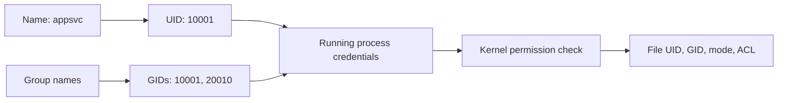
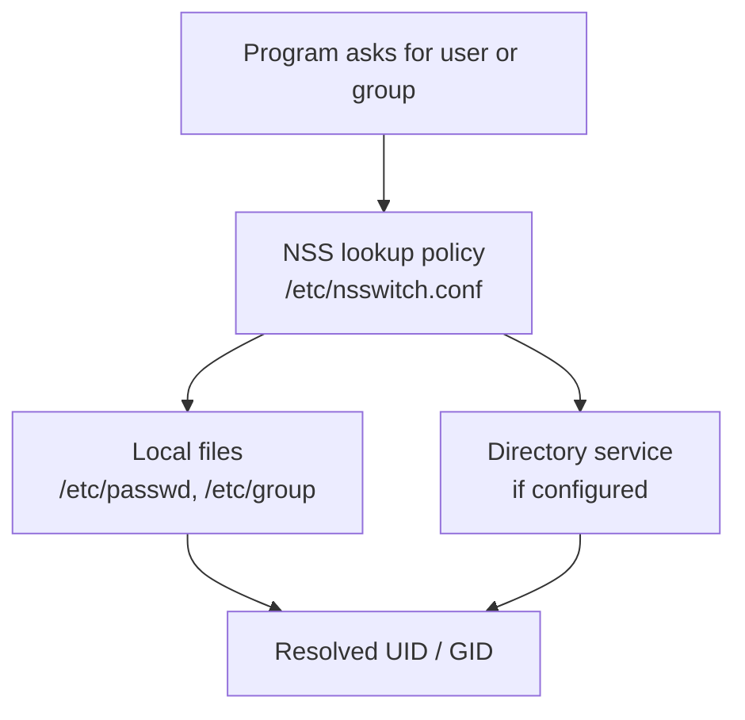
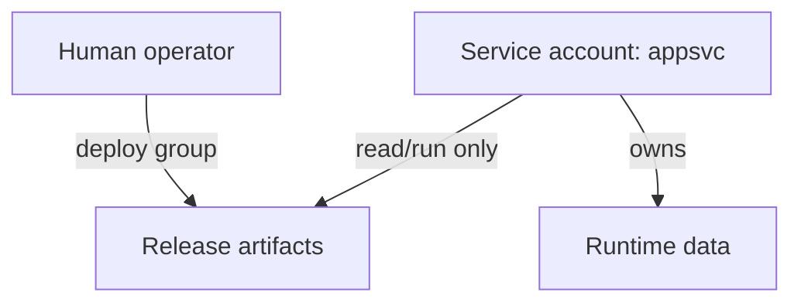

# Module 04: Users and Groups

> 🎯 **Goal:** Understand the identities Linux uses to run people, services, containers, and automated jobs.

By the end of this module, you should be able to inspect your UID and groups, distinguish human accounts from service accounts, safely create or modify a local account in a practice environment, and explain why a process's user matters more than the username shown in a terminal prompt.

---

## Why this matters

Every file you touch, every process you run, and every permission check you saw in module 03 is enforced against a user and a group. You cannot reason about `chmod`/`chown` without knowing who "the owner" or "the group" actually is, and you cannot administer a real server (or a Docker container running as a specific UID) without knowing how to create, inspect, and manage users. In WSL2 this also explains why your terminal can run `sudo` without a password prompt sometimes, and what "root" actually means on your machine.

## Concepts

### Identity is part of the runtime

Linux authorizes a process using numeric user and group IDs (UIDs and GIDs). Names such as `ubuntu`, `www-data`, and `root` are convenient labels stored in account databases. This matters in Docker and on mounted volumes: matching names is not enough if the numeric IDs differ. When diagnosing access, check both the file ownership and the identity of the process trying to use it.

**A user is an identity.** Every process on Linux runs "as" some user, and every file is owned by some user (this is exactly the "owner" from module 03's permission bits). Users have a username (like `paresh`) and, under the hood, a numeric user ID (UID). UID 0 is always `root`, the superuser who bypasses normal permission checks.

**A group is a named set of users.** Groups let you grant a permission to several people at once instead of one at a time. Every user belongs to at least one group (their "primary group," usually created just for them), and can additionally belong to any number of "supplementary" groups. This is exactly the "group" column from module 03's `rwx` permission bits — when a file's group is `sudo` and has group-read permission, every member of the `sudo` group can read it.

**`/etc/passwd`** is a plain text file listing every user account on the system, one per line, fields separated by colons: username, an `x` placeholder (the real password hash lives elsewhere, in `/etc/shadow`), UID, primary GID, a comment field, home directory, and login shell. You don't need to memorize every field, but knowing "this is just a text file you can read" demystifies user accounts entirely.

**`/etc/group`** is the group equivalent: one line per group, with group name, a placeholder, GID (group ID), and a comma-separated list of member usernames.

For example:

```text
paresh:x:1000:1000:Paresh:/home/paresh:/bin/bash
sudo:x:27:paresh,student1
```

| File | Fields shown | Why it matters |
| --- | --- | --- |
| `/etc/passwd` | name, placeholder, UID, primary GID, comment, home, login shell | Maps a human-readable name to an account's identity and default environment |
| `/etc/group` | group name, placeholder, GID, listed supplementary members | Maps a group name to its numeric ID and explicit members |

The `x` placeholders indicate that password hashes are stored separately in `/etc/shadow`, which is intentionally protected from ordinary accounts.

A user's identity is really just a number (the UID) — the username is a human-friendly label mapped to it. This is exactly why file ownership survives things like renaming an account, and why Docker containers (which you'll meet in the next track) can run "as UID 1000" without any username existing inside the container at all.

**`sudo` and the principle of least privilege.** Running everything as `root` all the time is dangerous — one typo in a root shell can wipe a filesystem or misconfigure the whole system. Instead, ordinary users run as themselves day to day, and prefix a single command with `sudo` ("superuser do") when they need root privileges just for that one command. Linux then logs the action and asks (usually) for your own password to confirm. This "escalate only when needed, only for what's needed" approach is the principle of least privilege: you don't hand out more power than a task requires.

**`su`** ("substitute user" or "switch user") starts a new shell as a different user (root by default), and you stay in that shell until you `exit`. `sudo` is generally preferred today because it runs one command at a time and keeps a clear audit trail, rather than dropping you into an open-ended root shell.

| Tool | Example | Scope | Best use |
| --- | --- | --- | --- |
| `sudo` | `sudo apt update` | One command | A deliberate administrative action |
| `su - student1` | `su - student1` | A new login shell until `exit` | Testing what another account can access |
| `sudo -i` | `sudo -i` | A root login shell until `exit` | Short, supervised administration when several root commands are genuinely necessary |

**WSL specifics.** When you installed Ubuntu on WSL2, the setup wizard created one Linux user for you and made that user a member of the `sudo` group automatically — this is why `sudo` usually works for you without needing anyone else to configure it. WSL also has a real `root` account (UID 0), just like any Linux system; you can reach it with `sudo` or `su`, and some WSL configurations even let a distro default to logging in as `root` (checked via `/etc/wsl.conf`), though that isn't the normal beginner setup. Being in the `sudo` group is what makes your everyday WSL user "an administrator" of the Linux distro — it is a group membership, not some special WSL-only magic.

### 1. Names are labels; IDs are the credentials Linux checks

When a process opens a file, the kernel evaluates its effective UID and GIDs. It does not ask whether the process's display name “looks like” the file owner. Account names are resolved to numbers before the permission model from module 03 is applied.



This is why a container can show a friendly username but still be unable to write to a bind-mounted file: the host sees the numbers, not the container's naming convention.

> [!key]
> For an access failure, identify the process's effective UID and groups, then inspect the target's numeric owner and group. Comparing names alone can hide the real mismatch.

### 2. Where account information comes from

On a basic WSL installation, local accounts are described in `/etc/passwd`, `/etc/shadow`, and `/etc/group`. On an organization-managed system, the same lookup can also involve LDAP, Active Directory, SSSD, or another identity service.

Use `getent` for investigation:

```bash
getent passwd "$USER"
getent group sudo
getent passwd 1000
```

`getent` asks the configured Name Service Switch (NSS), so it reports the identity source Linux actually uses. Reading `/etc/passwd` is useful for learning local accounts; `getent` is more portable for diagnosing a real server.



### 3. Primary groups, supplementary groups, and new sessions

Every logged-in process has one primary group and can carry zero or more supplementary groups. A process inherits these credentials from its parent, so adding a user to a group changes the account database but does **not** rewrite credentials already attached to open terminals or running services.

After `sudo usermod -aG developers alex`, open a new login session before testing access. `newgrp developers` can start a shell with a new primary group for a focused experiment, but logging out and in again is usually clearer for normal work.

> [!example]
> You add your account to the `docker` group, but `docker ps` still reports a permission error in the terminal you already had open. The group entry may be correct; that shell is simply still carrying its old supplementary-group list. Start a new session and run `id` before changing permissions on the Docker socket.

### 4. Human accounts and service accounts have different jobs

| Account type | Typical purpose | Login shell / home | Privilege pattern |
| --- | --- | --- | --- |
| Human account | An operator or developer signs in | Interactive shell and home directory | Only the access that person needs |
| Service account | Runs one application or daemon | Often no interactive login and a limited runtime directory | Narrow access to that application's files and sockets |
| `root` | System administration and recovery | Full system access | Used briefly and deliberately |

Create a dedicated service identity when a program needs persistent local files or a managed service. A service running as your personal account inherits access to your SSH keys, project files, and shell configuration that it does not need.

> [!pitfall]
> Do not make a service account a member of `sudo` merely to solve an application error. Give the service ownership of its runtime directory or a narrow capability through its service configuration. Broad administrator access turns a small application compromise into a host compromise.

### 5. `sudo` is policy, not a magic word

`sudo` checks the `/etc/sudoers` policy and files under `/etc/sudoers.d/`, then runs a requested command as another user (root by default). It does not permanently turn your terminal into root; `sudo -i` is the separate choice to start a root login shell.

Use these read-only checks before editing privilege policy:

```bash
sudo -l                 # commands your current user may run with sudo
getent group sudo       # accounts in the conventional Ubuntu admin group
sudo visudo -c          # validate sudo policy syntax
```

Only edit sudo policy through `visudo`, which validates syntax and protects against saving a broken policy file. A malformed sudoers file can remove the only administrator's access to a remote machine.

### 6. Safe account-change sequence

Account changes are persistent system changes. Make the intended state clear before typing a command:

1. Inspect whether the user or group already exists with `getent`.
2. Create a clearly named practice account only in a disposable environment.
3. Add only the required supplementary group with `usermod -aG`.
4. Open a new login shell and verify with `id`.
5. Remove the practice user and group when the exercise is complete.

> [!model]
> Treat account management like access provisioning: request a specific identity, grant a specific membership for a stated purpose, verify it from a new session, and remove it when the purpose ends. The command is only one step in that lifecycle.

## Command reference

| Command | What it does | Example |
|---|---|---|
| `whoami` | Prints the username you're currently logged in as. | `whoami` |
| `id` | Shows your UID, primary GID, and every supplementary group you belong to. | `id` prints something like `uid=1000(paresh) gid=1000(paresh) groups=1000(paresh),27(sudo)` |
| `id <user>` | Shows UID/GID info for another user instead of yourself. | `id root` shows root's UID (0) and groups |
| `groups` | Lists just the group names you belong to. | `groups` |
| `groups <user>` | Lists the groups a specific user belongs to. | `groups paresh` |
| `getent passwd <name>` | Looks up an account through the system's configured identity sources. | `getent passwd appsvc` |
| `getent group <name>` | Looks up a group through the system's configured identity sources. | `getent group developers` |
| `sudo -l` | Lists the commands your current user is allowed to run with `sudo`. | `sudo -l` |
| `sudo visudo -c` | Checks sudo policy syntax without editing it. | `sudo visudo -c` |
| `sudo <command>` | Runs a single command as root (or another user with `-u`), after confirming your password. | `sudo apt update` runs `apt update` with root privileges |
| `sudo -i` | Starts an interactive root login shell (use sparingly, and `exit` when done). | `sudo -i` |
| `su <user>` | Switches to another user's shell (prompts for that user's password); with no argument, switches to root. | `su - paresh` switches to user `paresh`, `-` loads their full login environment |
| `sudo adduser <name>` | Interactively creates a new user: prompts for password and optional details (full name, etc.), and creates a home directory. Friendlier, higher-level than `useradd`. | `sudo adduser dev1` |
| `sudo useradd -m <name>` | Lower-level command to create a user; `-m` creates a home directory (without it, none is made). Doesn't set a password or ask questions. | `sudo useradd -m dev2` |
| `passwd` | Changes your own password. | `passwd` |
| `sudo passwd <user>` | Sets or changes another user's password (root privilege required). | `sudo passwd dev2` |
| `sudo groupadd <name>` | Creates a new group. | `sudo groupadd developers` |
| `sudo usermod -aG <group> <user>` | Adds a user to a supplementary group without removing them from existing groups. `-a` means "append," `-G` names the group(s); always use `-a` together with `-G` or you'll wipe out the user's other group memberships. | `sudo usermod -aG developers dev1` |
| `sudo deluser <user>` | Removes a user account (Debian/Ubuntu-friendly wrapper); add `--remove-home` to also delete their home directory. | `sudo deluser --remove-home dev2` |
| `sudo userdel <user>` | Lower-level command to remove a user account; add `-r` to also remove their home directory and mail spool. | `sudo userdel -r dev2` |
| `sudo deluser <user> <group>` | Removes a user from a specific group without deleting the account. | `sudo deluser dev1 developers` |

## Hands-on exercises

1. Open your WSL2 Ubuntu terminal. Run `whoami` and then `id`. Note your username, UID, primary group, and every group listed after `groups=`. You should see `sudo` in that list — that's why you can run administrative commands.

2. Run `getent passwd "$(whoami)"`. Identify which colon-separated field is your UID and which is your home directory. This asks Linux's configured identity lookup rather than assuming the account exists only in a local file.

3. Run `getent group sudo`. Confirm that your account has administrative membership by comparing this result with `id` and `sudo -l`. On some systems, group membership can be supplied by another identity source, so treat the final comma-separated list as useful evidence rather than the only source of truth.

4. Inspect password-file protection without reading password hashes. Run `ls -l /etc/passwd /etc/shadow`, then run `stat -c '%A %U:%G %n' /etc/passwd /etc/shadow`. Explain why ordinary users can look up account names but should not be able to read the protected password database. Do **not** use `sudo cat /etc/shadow` for this exercise.

5. Create a new group called `learners`: `sudo groupadd learners`. Then confirm it exists: `cat /etc/group | grep learners`.

6. Create a new user called `student1` with a home directory: `sudo adduser student1`. Follow the prompts to set a password (anything you'll remember) and press Enter through the optional details. Afterward, confirm the home directory was created: `ls -la /home`.

7. Add `student1` to the `learners` group you created: `sudo usermod -aG learners student1`. Verify it worked: `groups student1` should now list both `student1` and `learners`.

8. Switch into that user's shell: `su - student1` (enter the password you set). Run `whoami` and `id` to confirm you're now `student1`. Then `exit` to return to your own shell — run `whoami` again to confirm you're back.

9. Prove that the practice user is not an administrator. As `student1` (use `su - student1` again), run `sudo -n true`. It should fail without a password prompt because `student1` has no sudo policy entry. Exit back to your own user. Do **not** add the practice user to the `sudo` group; the point is to confirm that a normal account cannot administer the machine.

10. Clean up: exit back to your original user, then delete the practice account entirely: `sudo deluser --remove-home student1`. Confirm it's gone: `cat /etc/passwd | grep student1` should print nothing.

## Production practice: accounts that run software

> [!key]
> Linux permissions are evaluated against numeric UIDs and GIDs attached to a process. A username is a human-friendly lookup; it is not the authority itself.

> [!model]
> A service account is like a badge issued to one job, not one person. Its permissions should be limited to the files, sockets, and network access that job requires. Giving a service your personal account makes audit trails and access boundaries blur together.



> [!example]
> A Node application can run as `appsvc`, own `/srv/myapp`, and belong to a `deploy` group that can read release artifacts. Operators may deploy through the group without becoming the service user, while the service cannot modify the deployment tooling.

> [!pitfall]
> Never edit `/etc/passwd`, `/etc/shadow`, or `/etc/group` with a normal text editor as a first choice. Use `useradd`, `usermod`, `groupadd`, and `getent`; they preserve account database consistency and make your intent explicit.

### Account-inspection workflow

Start with read-only questions:

```bash
id
id someuser
getent passwd someuser
getent group developers
ps -eo user,pid,command | head
```

`getent` is especially useful because it shows the account source the system actually uses, whether data comes from local files, LDAP, or another identity provider.

> [!exercise]
> In a disposable WSL environment, create a `labops` group and a non-login practice user. Add that user to the group, verify the numeric IDs with `id`, then remove the user from the group and verify again in a new shell. Do not use `root` as the practice account.

> [!interview]
> A Docker bind mount is owned by UID `1000` on the host, but the process in the container runs as UID `10001`. Explain why matching the visible usernames is insufficient and list two safe ways to resolve the write failure.

> [!check]
> - Can you distinguish a primary group from supplementary groups?
> - Do you know how to inspect an account without exposing `/etc/shadow`?
> - Can you explain why services should normally have dedicated, non-human accounts?

## Independent challenge

No commands given here — figure it out yourself using what you know from this module and earlier ones.

**Task:** Set up a small shared-access scenario from scratch. Create one new group and two new users, and make both users members of that group. Then create a single file, give it that shared group ownership, and set its permissions (combine this with the permission model from module 03) so that both group members can read and write the file, but no other user on the system can even read it. Finally, prove it actually works: become the second user and successfully edit the file, then reason about why a random third user could not. Clean up your practice users and group afterward.

<details>
<summary>Stuck? One hint</summary>

Group ownership is set with `chgrp` (or the `user:group` form of `chown`), and a mode like `rw-` for owner and group but nothing for other is exactly what module 03's octal digits are for; switch identities with `su -` to test as the second user.

</details>

## Common mistakes & troubleshooting

- **Forgetting `-a` with `usermod -G`:** running `sudo usermod -G newgroup user` (without `-a`) *replaces* all of the user's supplementary groups with just `newgroup`, silently kicking them out of `sudo` and everything else. Always use `-aG`.
- **Confusing `sudo <command>` with `su`:** `sudo` runs one command with elevated rights and returns you to your normal shell; `su` drops you into a whole new shell as another user until you `exit`. Forgetting you're still inside an `su` shell is a common source of "why isn't my file owned by me" confusion later.
- **Group membership not taking effect immediately:** if you add yourself to a new group with `usermod -aG`, your *current* shell session won't see the new group until you log out and back in (or start a fresh shell/run `newgrp <group>`). `id` in the same old session will still show the old group list.
- **Expecting a password prompt every time `sudo` is used:** `sudo` caches your successful authentication for a few minutes, so back-to-back `sudo` commands won't always re-prompt. This is normal, not a bug.
- **Typing your password and seeing nothing happen:** `sudo`/`passwd` prompts don't echo any characters (not even asterisks) while you type the password. This is intentional, not a frozen terminal.
- **Deleting a user without `--remove-home`/`-r`:** the account disappears from `/etc/passwd`, but their home directory and files remain on disk, silently owned by a now-nonexistent UID.

## Checkpoint quiz

Write down your answer to each question before expanding it — checking without attempting first is the single easiest way to fool yourself into thinking you've learned this.

1. What is the difference between a user's primary group and a supplementary group?
2. Why does `sudo` exist instead of everyone just working as `root` all the time?
3. You run `sudo usermod -G video alice` and later discover Alice can no longer run `sudo` commands. What went wrong, and what command would have avoided it?
4. What's the practical difference between `sudo some-command` and `su - someuser`?
5. Where would you look to see the list of groups a user belongs to, without running any command that requires typing a password?
6. Why is `/etc/shadow` not readable by ordinary users, while `/etc/passwd` is?
7. On a fresh WSL2 Ubuntu install, why can your default user typically run `sudo apt update` right away with no extra setup?
8. If you add yourself to a new group with `usermod -aG`, why might `id` still not show that group immediately?

<details>
<summary>Show answers</summary>

1. The primary group is the default group assigned to a user's files/processes and is recorded in `/etc/passwd`; it's usually a group created just for that user. Supplementary groups are additional group memberships (listed in `/etc/group`) that grant access to extra resources without changing the user's default group.
2. Running everything as root removes all permission safety nets — one mistaken command can damage the whole system. `sudo` lets ordinary users escalate privileges only for the specific command that needs it (principle of least privilege), keeping day-to-day work unprivileged and safer, while still logging what was run.
3. Using `usermod -G video alice` without `-a` replaced all of Alice's supplementary groups with just `video`, removing her from `sudo`. The fix is `sudo usermod -aG video alice`, where `-a` appends the group instead of replacing the list.
4. `sudo some-command` runs a single command with root privileges and immediately returns you to your own shell as your own user. `su - someuser` starts a whole new login shell as that other user, and you remain in that shell (as them) until you explicitly `exit`.
5. Read `/etc/group` directly (e.g. `cat /etc/group`) — it lists group names and their members without requiring `sudo` or a password.
6. `/etc/passwd` needs to be readable by everyone because many ordinary programs look up usernames/UIDs from it, but it no longer stores password hashes. `/etc/shadow` holds the actual password hashes and is restricted to root so other users can't attempt to crack them offline.
7. Because the WSL setup wizard automatically added the first Linux user it created to the `sudo` group, so that user has administrative rights on the distro from the start, without any manual configuration.
8. Because `id` reflects the group memberships of your *current login session*, which were computed when that shell/session started. A group added afterward only takes effect in new sessions/shells (or after `newgrp`), not the already-running one.

</details>

## Further reading & sources

- [`man7.org`: passwd(5)](https://man7.org/linux/man-pages/man5/passwd.5.html) and [group(5)](https://man7.org/linux/man-pages/man5/group.5.html) - the authoritative field-by-field spec for the two files this module reads directly.
- [`man7.org`: sudo(8)](https://man7.org/linux/man-pages/man8/sudo.8.html) and [sudoers(5)](https://man7.org/linux/man-pages/man5/sudoers.5.html) - how `sudo` decides who can run what; worth skimming once you're curious why `sudo` "just works" for your WSL user.
- [Microsoft: Advanced WSL config (`/etc/wsl.conf`)](https://learn.microsoft.com/en-us/windows/wsl/wsl-config#configuration-settings-for-wslconf) - covers the `[user] default=` setting mentioned above for making a distro log in as a specific user (including root).
- [DigitalOcean: Linux Users and Groups Explained](https://www.digitalocean.com/community/tutorials/linux-basics-users-and-groups) - a widely-used, beginner-friendly walkthrough covering the same ground with different worked examples.

## Next

Continue to [05 - Package Management with APT](../05-package-management-apt/README.md) to learn how to install and manage the real software (like `htop` and `tree`) you'll use in the process-management module right after it.
