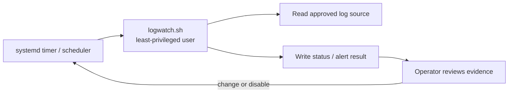
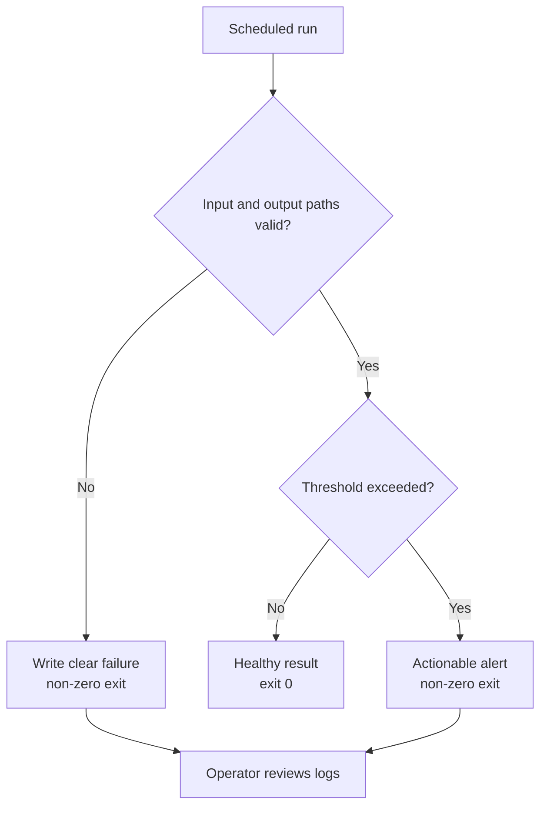

# Module 16: Capstone Project — Log Watchdog

> 🎯 **Goal:** Combine the Linux track into a small, secure, observable automation that solves a realistic operational problem.

This capstone is successful when you can explain every moving part: where the script runs, which user owns it, which logs it reads, how it handles an error, how its output is inspected, and how you would safely disable or change it later.

---

## Why this matters

Real Linux work is rarely one command in isolation — it's scripts that parse
text, check system state, run on a schedule, and are locked down so they
can't be tampered with or leak data. This project forces you to combine
everything from modules 00-15 into one working piece of automation, the way
you'd build a small piece of infrastructure tooling on the job. It is also
the bridge into the Docker track: the next thing you'll do with this exact
script is put it inside a container.

## The project

### Build it like a small production service

Work in a practice directory or a disposable WSL environment. Keep configuration separate from executable code, avoid embedding secrets, test the script manually before scheduling it, and document the checks that prove it works. The goal is not to make a complex watchdog; it is to demonstrate careful command-line reasoning, safe automation, and a clear operational handoff.

Build **Log Watchdog**: a bash script, run automatically on a schedule by
systemd, that scans a directory of log files for problems, archives old
logs, checks disk usage, and reports anything that needs attention — all
running as a locked-down, non-root setup.

You will work independently. This document gives you requirements,
acceptance criteria, and hints — not a solution. Expect to spend real time
on this; that's the point.

The moving pieces, at a glance (you're wiring this together, not being
handed the wiring):

```
  systemd timer (OnCalendar=... , module 11 + new: timers)
        │  fires periodically
        ▼
  systemd service (runs logwatch.sh as the `logwatch` user, NOT root)
        │
        ▼
  logwatch.sh
        ├─ reads   /opt/logwatch/logs/       (grep/awk/sed, module 08)
        ├─ archives old files → /opt/logwatch/archive/  (module 12)
        ├─ checks  df/du against a threshold  (module 12)
        ├─ writes  /opt/logwatch/reports/     (only if a threshold trips)
        └─ logs its own run via `logger`      (→ journald, module 14)
```

Note this project introduces one new systemd concept beyond module 11:
**timer units** (`.timer`, paired with a `.service`) for scheduled,
recurring runs — module 11 only covered starting a service once by hand.
The further-reading link below covers the syntax you'll need.

### Part 1 — Set the stage

1. Create a dedicated system user for this project (module 04), e.g. `logwatch`, with no login shell needed for interactive use but able to own files.
2. Create a working directory tree, e.g.:
   - `/opt/logwatch/bin/` — the script lives here
   - `/opt/logwatch/logs/` — sample input logs live here
   - `/opt/logwatch/archive/` — rotated/archived logs go here
   - `/opt/logwatch/reports/` — output reports go here
3. Generate realistic-ish sample log files in `/opt/logwatch/logs/` with a mix of `INFO`, `WARN`, and `ERROR` lines, timestamps, and a few different "services" (e.g. `auth`, `api`, `worker`). You can hand-write these or script their generation. Make some files old (use `touch -d` to backdate) and some recent.

### Part 2 — The script (`/opt/logwatch/bin/logwatch.sh`)

Requirements:

- Proper shebang, and the script must be executable only by its owner/group as appropriate (module 03).
- Accepts the log directory as an argument (don't hardcode it) with a sensible default and a usage message if misused (module 09: `$1`, `$#`).
- Uses `grep`/`awk`/`sed` (module 08) to:
  - Count `ERROR` and `WARN` lines per file and per service.
  - Extract the actual error messages (not just counts) into a summary.
- Archives log files older than N days (your choice, e.g. 7) from `logs/` into `archive/`, compressed (`gzip` or `tar`), and removes the originals from `logs/` once archived. Do not delete data — only move/compress it.
- Checks disk usage of the filesystem holding the log directory (module 12: `df -h`) and, separately, the total size of the archive directory (module 12: `du -sh`).
- Defines a disk usage threshold (e.g. 80%). If exceeded, or if the ERROR count exceeds a threshold you define, the script prints a clearly marked WARNING block to stdout **and** appends it to a report file in `reports/`. ("Email" is optional/simulated — printing a loud warning is enough; if you want to go further, piping to `mail`/`sendmail` if installed, or just a `echo` to a "would-have-emailed" log, is fine.)
- Uses proper exit codes (module 09: `$?`) — zero for "ran clean," non-zero for "found problems" or "hit an error" — so a scheduler could react to them.
- Logs its own run (start time, what it did, end time) somewhere sensible, e.g. via `logger` (ties to module 14/journald) or its own log file.
- Handle errors defensively: what happens if the log directory doesn't exist? If it's empty? If it's not readable by the script's user? Don't let it crash with a raw stack of Bash errors — check and report cleanly.

### Part 3 — Run it on a schedule

1. Write a systemd **service** unit (module 11) that runs `logwatch.sh` once, as the `logwatch` user (or another appropriately restricted user), not root.
2. Write a systemd **timer** unit paired with that service to run it periodically (e.g. every 15 minutes, or hourly — your choice, but must be a timer, not a cron job, since this module is systemd-focused).
3. Enable and start the timer, confirm it fires (module 14: `journalctl -u logwatch.service`, `systemctl list-timers`).

### Part 4 — Lock it down

1. Set ownership and permissions (modules 03 and 04) so that:
   - The script is owned by an appropriate user/group, is executable, but is **not writable** by anyone except its owner (prevent tampering).
   - The `reports/` and `archive/` directories are writable only by the user the script runs as — not world-writable.
   - Regular/other users on the box cannot read log contents that might be sensitive (your call on how strict, but be able to justify it).
2. Verify the timer/service actually runs as the unprivileged user you intended, not root — prove it (e.g. have the script write `whoami`/`id` output into its own run log during testing, then remove/tighten that once confirmed).

## Operational design review

> [!key]
> The capstone is not complete because the script runs once. It is complete when its inputs, privileges, schedule, output, failure behavior, and removal path are all understood and verified.

> [!model]
> The watchdog is a small operations system: a scheduler invokes a least-privileged script; the script reads a defined log source; it produces an observable result; and an operator can use that result to decide what to do next.



The architecture shows the normal path. The failure path is equally important because it defines what an operator should trust and do next.



> [!example]
> A good first watchdog checks a single log file for a defined error pattern over a defined interval, exits `0` when healthy and non-zero when it finds the threshold, and writes a concise timestamped result. It does not attempt to repair the service automatically.

> [!pitfall]
> Do not schedule an untested script or run it as root just because the scheduler can. Test the exact command as the intended service account, use absolute paths, keep output somewhere inspectable, and make every destructive action opt-in.

### Suggested delivery sequence

1. Write the script and make it work manually against a sample log.
2. Add argument validation, clear output, and meaningful exit codes.
3. Restrict ownership and permissions to the intended runtime identity.
4. Schedule one safe, observable run.
5. Inspect status and logs after it runs.
6. Document how to stop, disable, or remove the watchdog.

> [!exercise]
> Before scheduling, create a test matrix: empty log, one matching line, threshold exceeded, unreadable log, and missing output directory. For each case, record the expected output and exit status, then run the matrix manually.

> [!interview]
> Present your watchdog as if handing it to an on-call engineer: explain its trigger, identity, inputs, outputs, failure modes, permissions, and the one command that disables it safely.

> [!check]
> - Can you run and test the watchdog without `sudo` except where its defined log access requires it?
> - Does its output make the next human action clear?
> - Can another learner remove the scheduler and files using your documentation?

## Acceptance criteria checklist

- [ ] Dedicated non-root user created and used to run the job
- [ ] Directory structure created with correct ownership
- [ ] Sample logs generated with realistic mixed severity content and a mix of old/new timestamps
- [ ] Script takes the log directory as a configurable argument with a default and usage/help output
- [ ] Script correctly counts and extracts ERROR/WARN lines using grep/awk/sed
- [ ] Script archives (compresses, moves) logs older than N days without deleting data
- [ ] Script checks disk usage (df) and archive size (du) against a threshold
- [ ] Script prints and persists a clear warning when a threshold is breached
- [ ] Script exits with meaningful, distinct exit codes
- [ ] Script handles missing/empty/unreadable directories gracefully, without raw crashes
- [ ] systemd service unit runs the script as the intended non-root user
- [ ] systemd timer unit triggers the service on a schedule, confirmed via `systemctl list-timers` and `journalctl`
- [ ] Script file and output directories have correct, minimal permissions (no unnecessary write/read access for other users)
- [ ] You can explain, out loud, every permission and ownership decision you made

## Hints (if you get stuck)

- Start by writing and testing the script manually from your own shell before wiring up systemd or new users — get the logic right first, then lock it down.
- `awk -F' ' '{print $N}'` and matching on the literal strings `ERROR`/`WARN` will get you further than you'd expect; you don't need fancy regex for a first pass.
- `find /opt/logwatch/logs -type f -mtime +7` is the natural way to find "old" files (module 02's `find`, extended with `-mtime`).
- Test threshold logic by temporarily setting the threshold artificially low (e.g. 1%) so you can see the warning path fire without waiting for a real full disk.
- `systemctl status`, `journalctl -u <unit> -f`, and `systemctl list-timers --all` are your three best friends for debugging the systemd half.
- If the timer never fires, check `OnCalendar=`/`OnBootSec=` syntax carefully and remember to `systemctl daemon-reload` after editing unit files (module 11).
- If permissions block the script from writing where it needs to, resist the urge to `chmod 777` — figure out which specific user/group needs which specific access and grant only that (module 03/04 mindset).

## Further reading & sources

- [`man7.org`: systemd.timer(5)](https://man7.org/linux/man-pages/man5/systemd.timer.5.html) - the unit type this project needs that module 11 didn't cover; `OnCalendar=`/`OnBootSec=` syntax and examples.
- [Ubuntu docs: Scheduling Tasks with Cron/Timers](https://ubuntu.com/server/docs/scheduling-tasks-with-cron) - covers the older `cron` approach alongside timers for context, even though this project specifically wants a timer.
- [`man7.org`: logger(1)](https://man7.org/linux/man-pages/man1/logger.1.html) - how to send a script's own run log into journald, referenced in the Part 2 requirements.
- [`man7.org`: find(1)](https://man7.org/linux/man-pages/man1/find.1.html) - full reference for `-mtime` and related time-based filters used to find "old" log files.

## What's next

This script — a real, if small, piece of production tooling — is exactly
what you'll containerize next. In the Docker track you'll package
Log Watchdog (or something like it) into an image, learn why "it works on
my machine" stops being an excuse once it's in a container, and start
thinking about how this same job would run as a Kubernetes CronJob later
in the curriculum.

Back to [01-linux/README.md](../README.md) · Continue to [02-docker](../../02-docker/README.md).

## Before you move on

A day or two after you finish Log Watchdog, come back and add one new capability to it entirely from memory — don't reread this page or copy from your earlier work while you do it. Invent the extension yourself (a new kind of check, a new report field, a tighter permission, whatever you like), and only look things up once you're genuinely stuck. Rebuilding a piece of it cold is the single best way to find out what actually stuck before you carry these skills into the Docker track.
